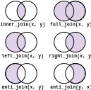

```{r setup, include=FALSE}
knitr::opts_chunk$set(
  echo = FALSE,
  warning = FALSE,
  message = FALSE
)

library(dplyr)
library(dbplyr)
library(DBI)
library(nycflights13)
library(RSQLite)
```

## Introduction
In today's Coffee & Coding we're going to be exploring data joining operations
and how to use them in R. We'll also be covering how you can use R to connect to
a database, create a SQL query, and extract the results of that query into R.

## What are joins?
Data joins are operations that you can perform to combine 2 or more data sets.
If you're an Excel user then you might have already done something like this
before if you've ever used a `VLOOKUP()` to combine data from 2 different
sources. Like a `VLOOKUP()`, join operations require a common field and values
-- called a key -- between the 2 data sets that you want to combine. Joins are
essential operations in languages like SQL, R, and Python.

Let's take a quick look at a small example of a join. We'll make a small sales
data set. This data set is just a set of customer IDs and the number of products
that they have bought from our fake shop.

```{r sales_data}
sales_df <- data.frame(customer_id = c(1:6),
                       products_sold = c(45, 12, 28, 52, 19, 37))

sales_df |> knitr::kable()
```

Now let's create a table that holds our customer's details.

```{r customer_data}
customers_df <- data.frame(customer_id = c(1:6),
                           customer_name = c("Natasha Romanoff", 
                                             "Tony Stark", 
                                             "Bruce Banner",
                                             "Carol Danvers",
                                             "Steve Rogers",
                                             "Peter Parker"))

customers_df |> knitr::kable()
```

We want to find out the name of the customer who has bought the most products
from our shop. We can do this by joining our sales data to our customer data.
There are a few packages in R that we can do joins with, but today we'll use the
`{dplyr}` package.

```{r sales_customer_data, echo=TRUE}
sales_customer_df <- dplyr::inner_join(
  x = sales_df,
  y = customers_df,
  by = "customer_id"
)

sales_customer_df |> knitr::kable()
```

Here we've now combined the `sales_df` and the `customers_df` tables using a
`inner_join()` and the `customer_id` column as our key.

### What is an inner join?
An inner join is an operation that combines the 2 tables on the key provided,
but only returns rows where the value in the join key appears in both tables.

In our small example we use `customer_id` as our join key, fortunately each 
`customer_id` in `sales_df` also appears in `customers_df`. But what if we had
a new customer who hasn't registered their details with us yet.

```{r new_customer_data}
sales_df <- bind_rows(sales_df, c("customer_id" = 7, "products_sold" = 67))

sales_df |> knitr::kable()
```

We've added some data to our sales data, now lets try to join to our customer
data again.

```{r sales_customer_data_2, echo=TRUE}
sales_customer_df_2 <- dplyr::inner_join(
  x = sales_df,
  y = customers_df,
  by = "customer_id"
)

sales_customer_df_2 |> knitr::kable()
```

We still get the same result as before, and that's because we don't have a 
corresponding value for customer `7` in the customers table.

## Different joins
There are multiple different types of joins that you can use to combine data.
We need different ways to join data to enable us to return the rows that we want
even if there aren't corresponding values in the join key that we use between 2
tables. Here are some of the other types of joins that you're likely to use.

### Left outer join
Joins use the concept of left hand and right hand to differentiate the 2 tables
that you are trying to combine. In our sales customers example, `sales_df` was
our left hand table (given to the `x` argument) and `customers_df` was our right
hand table (given to the `y` argument).

A left outer join will return all records from our left hand table along with 
any matching records from our right hand table.

### Right outer join
A right outer join acts in a similar way to the left outer join, but returns all
records from the right hand table and only matching records from our left hand
table.

### Full outer join
A full outer join returns all records from both tables. Where there are no
matching records a full outer join will populate the data with `NULL` (or `NA`
in R).

### Visualising how it works


## Exercises
In the `{nycflights13}` package are a collection of tables relating to flights 
that departed New York city in 2013:

* `flights`
* `planes`
* `airlines`
* `airports`
* `weather`

These tables can be joined together to provide more information about individual
flights. Can you use what you've learnt so far to answer the following questions:

1. what was the destination of the flight that departed EWR on 1 January 2013 at
05:17, and what time zone is this destination in?

2. how many flights that departed NYC in 2013 were planes model A320-214?

You will have to use some other dplyr verbs such as `select()`, `filter()`, and
`summarise()` as well.

```{r excercises_1, eval=FALSE}
# question 1
flights |> 
  filter() |> 
  xxx_join() |>  # the join key for this table is c("dest" = "faa")
  select()

# question 2
flights |> 
  xxx_join() |> # the join key for this table is c("tailnum" = "tailnum")
  filter() |>
  group_by() |> 
  summarise()
```

## Generating SQL
Typically you use joins to combine tables that are held in a relational database
and use SQL to query the database. So far we've used `{dplyr}` to join some 
dataframes in R, but we can use an accompanying package -- `{dbplyr}` -- to do 
the same with tables in a database. `{dbplyr}` uses the same verbs found in 
`{dplyr}` to generate SQL and then uses `{DBI}` in the background to query a 
database and return the results.

### Setting up our database
In order to show how this works we need to create a quick and simple in-memory
database. We'll create a small SQLite database and transfer the `nycflights13`
data to it.

```{r db_setup, echo=TRUE}
db <- nycflights13_sqlite()

flights_db <- tbl(db, "flights")
planes_db <- tbl(db, "planes")
airlines_db <- tbl(db, "airlines")
airports_db <- tbl(db, "airports")
weather_db <- tbl(db, "weather")
```

### Lets test it out
We can use existing syntax that we're already familiar with to construct our 
query to our database

```{r flights_db_qry, echo=TRUE}
qry <- flights_db |> 
  filter(month == 1) |> 
  left_join(
    airlines_db,
    by = c("carrier" = "carrier")
  ) |> 
  select(
    year,
    month,
    day,
    dep_time,
    carrier,
    name,
    flight,
    tailnum
  )

qry |> show_query()
```

Now that we've constructed our SQL query we can use it on our database to get
our data.

```{r flights_db_results, echo=TRUE}
results <- qry |> collect()

results |> head() |> knitr::kable()
```

You can use `{dbplyr}` to perform a massive array of database operations, 
including creating remote tables, while still using `{dplyr}` syntax. You can 
see more about [`{dbplyr}` online](https://dbplyr.tidyverse.org/).

## Exercises 2
Now that we've setup our small database, let's have a go at creating some 
queries to get some information out of it. Have a crack at answering some of 
these questions:

1. what is the name of the most popular destination from New York airports in 
March 2013?

2. what is the maximum number of passengers that could have travelled on planes
from New York airports in September 2019?

```{r exercises_2_1, eval=FALSE}
# question 1
q1_qry <- flights_db |> 
  filter() |> 
  left_join() |>
  group_by() |> 
  summarise(.groups = "drop") |> 
  slice_max() 

q1_qry |> show_query()

q1_qry |> collect()

```

```{r exercises_2_2, eval=FALSE}
# question 2
q2_qry <- flights_db |> 
 # ... fill in the rest of the query yourself 

q2_qry |> show_query()

q2_qry |> collect()
  
```

## Wrap up
Thank you for coming along! You can find a bunch of extra resources online for
anything relating to SQL, joins, and the R packages we've used today

* [`{dplyr}`](https://dplyr.tidyverse.org/)
* [`{dbplyr}`](https://dbplyr.tidyverse.org/articles/sql.html)
* [`{DBI}`](https://dbi.r-dbi.org/)
