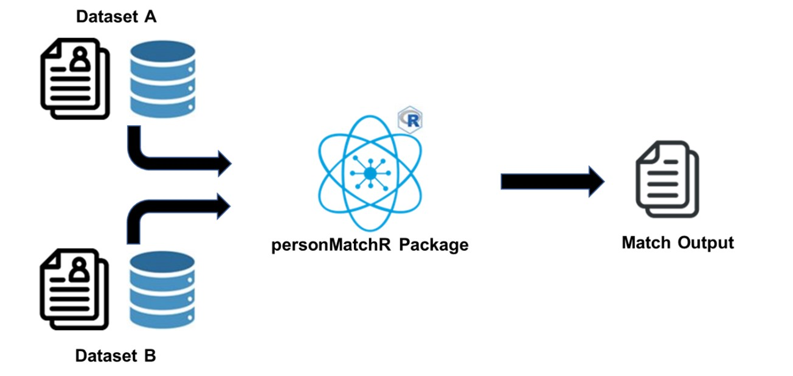

# Using personMatchR to match individuals across data-sets

The NHSBSA holds and has access to numerous data sets, across multiple service areas, where personal information is captured. There are some situations where, [**subject to Information Governance authorisation**]{.underline}, individuals may need to be matched across these data-sets or to other data-sets.

In an ideal world for this type of analysis, each data-set would include consistent unique identifiers (e.g., NHS number, NI number) which would allow the same individual to be identified. However, this is often not the case and therefore alternative methods need to be considered.

Rather than handling this on a case-by-case basis, requiring matching logic to be defined each time, the personMatchR is a potential solution, developed in the DALL team, allowing a consistent, efficient and reusable approach to be implemented.

## Automating the matching process

In any scenario involving matching individuals across data-sets there are three basic stages:

1.  Identify (and clean if required) two data-sets to match individuals across

2.  Define and perform the matching, apply fuzzy logic where required

3.  Handle the match output

Although steps 1 and 3 are likely to differ on a case-by-case basis, the personMatchR package can help with some of the data cleansing in step 1 and covers all of the actions for step 2.

{width="600"}

At the most basic level, the package will take two data-sets as inputs show which records (individuals) from data-set A can be matched to records in data-set B, either as an exact match or a confident match.

Throughout this script we will look at how to use the personMatchR package across some example test cases.

## Installing the personMatchR package

This package has been published by the DALL team and can be installed from the [NHSBSA Data Analytics GitHub repository](https://github.com/nhsbsa-data-analytics/personMatchR "GitHub repository for the personMatchR package").

```{r echo = TRUE, results = "hide", message = FALSE, warning = FALSE}
# install.packages("devtools")
devtools::install_github("nhsbsa-data-analytics/personMatchR")
# load relevant libraries
library("dplyr")
library("lubridate")
```

## Example test case using the personMatchR package

The easiest way to see how the package works is to run through a test case, which can be done using the test data that is embedded in the package.

### Data load

```{r}
# load the test data
df_A <- personMatchR::TEST_DF_A
head(df_A)
df_B <- personMatchR::TEST_DF_B
head(df_B)
```

Manually reviewing the test data would suggest that records 1,2 and 4 are the same people, with only minor variations in the data that represent common data capture issues.

### Running the matching function

The matching function takes the two data-sets as input parameters, with each key data field being defined, along with some parameters to state options to apply during the matching process.

```{r}
# call matching function
df_output <- personMatchR::calc_match_person(
  df_one = df_A, # first dataset
  id_one = ID, # unique id field from first dataset
  forename_one = FORENAME, # forename field from first dataset
  surname_one = SURNAME, # surname field from first dataset
  dob_one = DOB, # date of birth field from first dataset
  postcode_one = POSTCODE, # postcode field from first dataset
  df_two = df_B, # second dataset
  id_two = ID, # unique id field from second dataset
  forename_two = FORENAME, # forename field from second dataset
  surname_two = SURNAME, # surname field from second dataset
  dob_two = DOB, # date of birth field from second dataset
  postcode_two = POSTCODE, # postcode field from second dataset
  output_type = "key", # only return the key match results
  format_data = TRUE, # format input datasets prior to matching
  inc_no_match = TRUE # return records from first dataset without matches
)

# review results
df_output |> arrange(DF1_INPUT_ID, DF2_INPUT_ID)
```

### Parameter focus: output_type

This parameter can be used to what information is included in the output, and includes the following options: key / match / all.

In most scenarios the "key" option would be sufficient as the output could be joined back to the input if additional fields were required as this would allow for more bespoke formatting of the data.

```{r}
# output_type = key
# only the record IDs and the match outcome is returned
# this was the option we used in the original match test
df_output

# output_type = match
# the output will also include the personal information fields used for matching
df_output_type_match <- personMatchR::calc_match_person(
  df_A, ID, FORENAME, SURNAME, DOB, POSTCODE,
  df_B, ID, FORENAME, SURNAME, DOB, POSTCODE,
  format_data = TRUE, inc_no_match = TRUE,
  output_type = "match"
)
df_output_type_match

# output_type = match
# the output will also include the individual field match scores and any additional fields not used for matching
df_output_type_all <- personMatchR::calc_match_person(
  df_A, ID, FORENAME, SURNAME, DOB, POSTCODE,
  df_B, ID, FORENAME, SURNAME, DOB, POSTCODE,
  format_data = TRUE, inc_no_match = TRUE,
  output_type = "all"
)
df_output_type_all
```

### Parameter focus: inc_no_match

This parameter will define if the results should include records from the first data-set that could not be matched to any records in the second data-set. The choice to use here will depend on the use case and whether or not this information would be useful, although excluding it is not needed could remove unnecessary records from the output, which may be beneficial for large data-sets.

```{r}
# inc_no_match = TRUE
# data will be included where no match was possible
# this was the option we used in the original match test
df_output

# output_type = FALSE
# the output will only include records where some matching was possible
df_output_excl_nomatch <- personMatchR::calc_match_person(
  df_A, ID, FORENAME, SURNAME, DOB, POSTCODE,
  df_B, ID, FORENAME, SURNAME, DOB, POSTCODE,
  format_data = TRUE, output_type = "key",
  inc_no_match = FALSE,
)
df_output_excl_nomatch
```

### Parameter focus: format_data

This parameter will define if the input data should have some formatting functions applied prior to matching. This is an important step and it is [**recommended that this is always used**]{.underline} as otherwise the match quality may be impacted.

```{r}
# format_data = TRUE
# data will be formatted prior to matching
# this was the option we used in the original match test
df_output

# output_type = FALSE
# the output will only include records where some matching was possible
df_output_unformatted <- personMatchR::calc_match_person(
  df_A, ID, FORENAME, SURNAME, DOB, POSTCODE,
  df_B, ID, FORENAME, SURNAME, DOB, POSTCODE,
  inc_no_match = TRUE, output_type = "key",
  format_data = FALSE
)
df_output_unformatted
```

The formatting functions applied to the data during the matching process can be used separately to see what changes they make to the data.

```{r}
# apply individual matching functions
head(df_A)
df_A_formatted <- df_A |> 
  personMatchR::format_date(date = DOB) |> 
  personMatchR::format_name(name = FORENAME)  |>  
  personMatchR::format_name(name = SURNAME) |>  
  personMatchR::format_postcode(id = ID, postcode = POSTCODE)
head(df_A_formatted)
```

**Please note: if using the database matching functions of the personMatchR package, there is no option to apply the formatting as part of the matching function call so these functions would need to be applied separately and the formatted data-sets used as the data inputs.**

## Testing across a larger data-set

In the example above we were comparing two data-sets with only a handful of records which would be easy to manually compare, but this package is useful when we may have thousands of records to compare. To give it a harder test we could look for individuals within a data-set containing 500 thousand records.

***Note: the matching functions for data frames are suitable for data-sets up to around 1 million records before system memory/performance issues may be encountered. For much larger data-sets storing the data in database tables and using the database matching functions from personMatchR would be recommended.***

### Create test data

Unfortunately finding a open source data-set which contains names, dates of births and addresses is not an easy task so instead we create our own data.

Starting with surname we can use a data-set from [kaggle which contains common surnames from England and Wales](https://www.kaggle.com/datasets/vinceallenvince/engwales-surnames?resource=download "Surname data-set from kaggle"). This data includes a frequency column so we can filter this to remove some obscure names that only appear once.

```{r}
df_surname <- read.csv("./data/engwales_surnames.csv") |> 
  dplyr::filter(Frequency >= 2) |> 
  dplyr::mutate(ID = dplyr::row_number()) |> 
  dplyr::select(ID, SURNAME = Name)

head(df_surname)
```

For the forenames we can use a data-set from [data.world that contains some common baby names](https://data.world/alexandra/baby-names "Forename data-set from data.world").

```{r}
df_forename <- read.csv("./data/babynames-clean.csv", header = FALSE) |> 
  dplyr::mutate(ID = dplyr::row_number()) |> 
  dplyr::select(ID, FORENAME = V1)

head(df_forename)
```

For postcodes, we will simply use all postcodes from the Newcastle region, which have been sourced from the [postcode data products](https://www.ons.gov.uk/methodology/geography/geographicalproducts/postcodeproducts "Postcode data published by ONS") published by Office for National Statistics.

```{r}
df_postcode <- read.csv("./data/ne_postcodes.csv") |> 
  dplyr::mutate(ID = dplyr::row_number())

head(df_postcode)
```

For date of births we will simply create our list of all dates that would cover a period of births for people aged between 18 and 50 as of the current date.

```{r}
df_dob <- as.data.frame(seq(
  lubridate::ymd(Sys.Date()) - lubridate::years(60),
  lubridate::ymd(Sys.Date()) - lubridate::years(18),
  by = "days"
)) |> 
  # rename the column
  dplyr::select(DOB = 1) |> 
  # convert to string
  dplyr::mutate(DOB = as.character(DOB)) |> 
  dplyr::mutate(ID = dplyr::row_number())

head(df_dob)
tail(df_dob)
```

The four pieces of information can be linked together into a single data-frame taking random selections from each one.

```{r}
# set a sample size for how many records we want
sample_size = 500000

# create a data-frame containing random numbers
df_persons = data.frame(
  ID = seq(1:sample_size),
  SURNAME_ID = sample(1:nrow(df_surname), size = sample_size , replace = TRUE),
  FORENAME_ID = sample(1:nrow(df_forename), size = sample_size , replace = TRUE),
  DOB_ID = sample(1:nrow(df_dob), size = sample_size , replace = TRUE),
  POSTCODE_ID = sample(1:nrow(df_postcode), size = sample_size , replace = TRUE)
)
head(df_persons)

# link back to the sample data to extract the data for the random selections
# drop the unwanted fields as we go
df_persons = df_persons |> 
  dplyr::inner_join(df_surname, by = c("SURNAME_ID" = "ID"), keep = FALSE) |> 
  dplyr::select(-SURNAME_ID) |>
  dplyr::inner_join(df_forename, by = c("FORENAME_ID" = "ID"), keep = FALSE) |> 
  dplyr::select(-FORENAME_ID) |> 
  dplyr::inner_join(df_dob, by = c("DOB_ID" = "ID"), keep = FALSE) |> 
  dplyr::select(-DOB_ID) |> 
  dplyr::inner_join(df_postcode, by = c("POSTCODE_ID" = "ID"), keep = FALSE) |> 
  dplyr::select(-POSTCODE_ID)
head(df_persons)
```

### Add some custom records

The randomly created data-set is unlikely to include any records that would match against our test data so we should add those to the test but we could add some variations to test specific scenarios. We can also update the postcodes for the original test data to reflect a Newcastle postcode, in line with the data we created.

```{r}
# update postcode fields
df_A_large_test <- df_A |> 
  dplyr::mutate(POSTCODE = "NE15 8NY")
df_B_large_test <- df_B |> 
  dplyr::mutate(POSTCODE = "NE15 8NY")

# add a new examples to the initial search data:
# custom record that can be changed to trial any scenarios
df_A_large_test <- rbind(df_A_large_test,
                         data.frame(
                           ID = 5,
                           SURNAME = "Buckley",
                           FORENAME = "Steven",
                           POSTCODE = "NE15 8NY",
                           DOB = "2000-01-01"
                         )
)

# add two new examples to the data we are looking for matches in:
# one will represent a potential father-son with the same name and address
# one will simply be a custom record that can be changed to trial any scenarios
df_B_large_test <- rbind(df_B_large_test,
                         data.frame(
                           ID = 5,
                           SURNAME = "Buckley",
                           FORENAME = "Stephen",
                           POSTCODE = "NE15 8NY",
                           DOB = "2000-01-01"
                         ),
                         data.frame(
                           ID = 6,
                           SURNAME = "O'Brien",
                           FORENAME = "Richard",
                           POSTCODE = "NE15 8NY",
                           DOB = "1972-03-25"
                         ),
                         data.frame(
                           ID = 7,
                           SURNAME = "Boggs",
                           FORENAME = "Joe",
                           POSTCODE = "NE15 8NY",
                           DOB = "1999-01-01"
                         )
)

# review the data
df_A_large_test
df_B_large_test

# run a quick test with just these examples
df_output_additional <- personMatchR::calc_match_person(
  df_A_large_test, ID, FORENAME, SURNAME, DOB, POSTCODE,
  df_B_large_test, ID, FORENAME, SURNAME, DOB, POSTCODE,
  inc_no_match = TRUE, output_type = "key", format_data = TRUE
)
df_output_additional |> arrange(DF1_INPUT_ID, DF2_INPUT_ID)
```

### Supplement with the synthetic data

To make the function work harder, instead of looking in 6 records we can get the function to look in a pot of 500 thousand records. As each record needs a unique ID we can just drop the first 6 records from the randomly created data and replace with our initial test cases, which will make sure we have data we would expect to match against.

```{r}
# drop the first x rows from the df_persons table
df_persons <- df_persons |> 
  dplyr::filter(ID >= 8)
# bind the two data-sets
df_B_large_test <- rbind(df_B_large_test, df_persons)
# view the first 10 records
head(df_B_large_test, n=10)
```

### Call the matching function on the revised data

```{r}
df_output_large_test <- personMatchR::calc_match_person(
  df_one = df_A_large_test, # first dataset
  id_one = ID, # unique id field from first dataset
  forename_one = FORENAME, # forename field from first dataset
  surname_one = SURNAME, # surname field from first dataset
  dob_one = DOB, # date of birth field from first dataset
  postcode_one = POSTCODE, # postcode field from first dataset
  df_two = df_B_large_test, # second dataset
  id_two = ID, # unique id field from second dataset
  forename_two = FORENAME, # forename field from second dataset
  surname_two = SURNAME, # surname field from second dataset
  dob_two = DOB, # date of birth field from second dataset
  postcode_two = POSTCODE, # postcode field from second dataset
  output_type = "key", # only return the key match results
  format_data = TRUE, # format input datasets prior to matching
  inc_no_match = TRUE # return records from first dataset without matches
)
df_output_large_test |> arrange(DF1_INPUT_ID, DF2_INPUT_ID)
```
