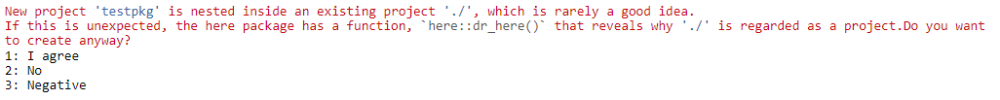
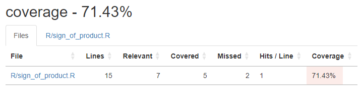
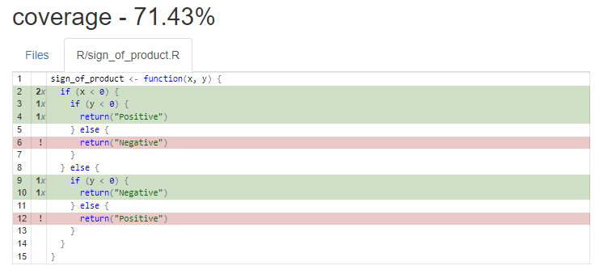
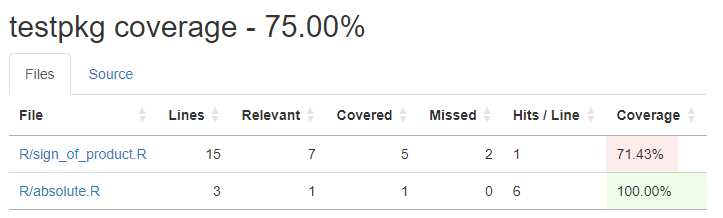

```{r setup, include=FALSE}
knitr::opts_chunk$set(echo = TRUE)

if (!require(librarian)) install.packages("librarian")

librarian::shelf(
  magrittr,
  testthat,
  covr,
  DT,
  htmltools,
  DiagrammeR,
  tufte
)
```

## Introduction

> "The first step is an intuition - and comes with a burst, then difficulties arise. This thing gives out and [it is] then that - “Bugs” as such little faults and difficulties are called – show themselves."
>
> `r tufte::quote_footer('Thomas Edison')`


### Testing code is a sound investment

When you write some code it is often not set in stone. You may go back to it to make improvements. Or the requirements could change. You might even become aware of a bug that you need to fix. It may even be someone else who changes the code, and do not know it as well as you. Testing is essentially a form of insurance. You spend some time up-front to add tests, so that when the code changes any problems are efficiently found. With a good set of tests, you will know immediately what broke the code. Debugging code is often time-consuming and difficult, so it pays to make the process of fixing a bug as easy as possible.

Imagine the below function is part of a code base. It returns the absolute value of a number (just as the base R function `abs` does). 

```{r}
absolute <- function(number) {
  return(sqrt(number * number))
}

absolute(-10)
```

Now imagine that someone decides later that this is better expressed using the `**` power operator (it isn't here, but makes an easy example). But they miss one `*`.

```{r}
absolute <- function(number) {
  return((number * number) * (1/2))
}

absolute(-10)
```
The function has been broken. With no automatic tests, this is likely to go unnoticed. Incorrect results could be in use for some time before anyone realises the error. The consequences of such a mistake could vary from none to extremely bad, depending on just where and how the code is used.

Assuming someone notices the error, someone now has to fix it. But how do they know where the error is coming from? Depending on the size and complexity of the code base this could be difficult to determine. Since the code itself is syntactically fine, bugs like this can be overlooked even by experienced coders actively looking for an error.

Some of the advantages of software testing are

* Detection of bugs before putting code into production
* Increased efficiency of the overall software development process
* Reduces both number of bugs and time to fix them
* Improves the quality of the code
* Aids 3rd parties re-using the code
* Potentially aids in optimising code (TDD)
* End users experience less problems
* Increases customer satisfaction and UX
* Automated testing is 'free' once written
* Test cases can be reused

There are also some disadvantages, including

* Time to write tests
* An individual test may never prove useful, e.g. if the code it tests never changes
* Additional complexity of a project, e.g. when some tested code changes, you must update the tests also

When considering these disadvantages, you have to take an overall perspective. Sometimes, the time taken to add tests does not pay off. But when a test saves hours or days of debugging it is a huge success. Anyone who has written code can likely remember many times when something went wrong and they struggled to find what the root cause was. 

Having an extensive suite of tests can give a false sense of security. While it is possible to test every single line of code, this is usually neither desirable or possible with limited resources. Focus on adding good tests to especially complex, critical and frequently used code over ensuring every line has at least some tests. For complex code especially, time may be better spent on refactoring into simpler units of code, with simple tests, instead of a monolithic set of branching tests.


## Different types of testing

There are numerous types of testing, enough that they are often discussed as a hierarchy.

```{r, echo=FALSE}
DiagrammeR::grViz("digraph {
    graph [
  		label = 'Software Testing\n\n'
  		labelloc = t
  		fontname = 'Helvetica,Arial,sans-serif'
  		fontsize = 20
  		layout = dot
  		rankdir = TB
  		newrank = true
  	]
  	node [
  		style=filled
  		shape=rect
  		pencolor='#00000044' // frames color
  		fontname='Helvetica,Arial,sans-serif'
  		shape=plaintext
  	]     
    rec1 [label = 'Testing']
    rec2 [label = 'Functional']
    rec3 [label =  'Non-Functional']
    rec4 [label = 'Unit']
    rec5 [label = 'Integration']
    rec6 [label = 'System']
    rec7 [label = 'Acceptance']
    rec8 [label = 'Security']
    rec9 [label = 'Performance']
    rec10 [label = 'Usability']
    rec11 [label = 'Compatibility']
    rec12 [fillcolor = '#ff880022' label = 'Automated\nGorilla (Random & manual)']
    rec13 [label = 'Component\nSystem\nEnd-to-End']
    rec14 [label = 'End-to-End\nSmoke\nSanity\nMonkey']
    rec15 [label = 'Alpha\nBeta\nUser Acceptance']
    rec16 [label = 'Penetration\nFuzz\nAccess Control']
    rec17 [label = 'Load\nStress\nVolume\nScalability\nEndurance\nRecovery']
    rec18 [label = 'Exploratory\nUI']
    rec19 [label = 'Cross Browser\nCross Platform']
    
    # edge definitions with the node IDs
    rec1 -> rec2
    rec1 -> rec3
    rec2 -> rec4 -> rec12
    rec2 -> rec5 -> rec13
    rec2 -> rec6 -> rec14
    rec2 -> rec7 -> rec15
    rec3 -> rec8 -> rec16
    rec3 -> rec9 -> rec17
    rec3 -> rec10 -> rec18
    rec3 -> rec11 -> rec19
  }")
```
Gorilla testing is so named for being an unplanned, brute force and manual method. Automated testing is opposite in its approach. Here you carefully plan what to test and write the tests so you can reuse them. The rest of this session will focus on automated unit testing.


## Testing in R

> "The problem is not that you don’t test your code, it’s that you don’t automate your tests."
>
> `r tufte::quote_footer('Hadley Whickham, in _R Packages_')`

The most popular testing package in the R ecosystem is `{testthat}`. This is designed to be used for unit testing of _packages_, rather than standalone scripts or `{shiny}` apps (e.g. apps that do not use the `{golem}` framework). It is still possible to use `{testthat}` outside packages with the `test_dir()` or `test_file()` functions, but this session will cover its use for packages only.


### Setting up the package

This will be a bit finicky, as normally you would not want to create a package inside another package. When running the next code snippet a prompt will ask user to confirm. Since the prompt requires the session to be interactive the code is set not to run when knitting the rmarkdown (knitting is non-interactive). Also, many of the following code snippets are set not to run on knit. Each code snippet to be run in the console is noted by the comment __`CONSOLE`__ at the top of the code.


If you want to follow along fully, run the next snippet in the console. This will create a new package `testpkg` in a sub-directory of the `2023-10-03 Automated Testing in R` folder.

```{r, eval=FALSE}
# CONSOLE

setwd("/cloud/project/2023-10-03 Automated Testing in R")
usethis::create_package("testpkg", open = FALSE)
```

Open the new project with the `testpkg.Rproj` file. This always sets the working directory to the package root folder and also lets Rstudio know which project you are working on. `usethis` also keeps track of which project is being worked on, but will auto-discover this in the next step as long as the working directory is the package root folder.

Setting up the package to use `testthat` is as simple as running the next snippet in the console. Note the working directory is set to `testpkg`. If not, `usethis` would find the overall Coffee & Coding project as the active project to add `testthat` to.

```{r, eval=FALSE}
# CONSOLE

setwd("testpkg")
usethis::use_testthat()
```

This creates a `tests` folder and configures `testthat` via the `testthat.R` file and the `DESCRIPTION` file. All `testthat` tests must live in files below `tests/testthat/` and __must__ begin with `test`.


### Adding code and tests together

Two handy functions in `usethis` are

* `usethis::use_r()`
* `usethis::use_test()`

Each will create or open a given file. They both will create a file if not already present and then open it in Rstudio. For example, you want to create a function named `foo`.

* `usethis::use_r("foo")`
* file `R/foo.R` created and opened
* write `foo` code
* `usethis::use_test()` while `foo.R` is the active file (or `usethis::use_test("foo")` if not)
* file `tests/testthat/test_foo.R` created and opened
* write test code
* run the tests with the `Run Tests` button in top right

Let's use the `absolute` function defined earlier to see this in action. First we create the function in the `R` folder.

```{r, eval=FALSE}
# CONSOLE

usethis::use_r("absolute")

# Copy this code to testpkg/R/absolute.R
absolute <- function(number) {
  return(sqrt(number * number))
}
```

Then a test file is created in the `testthat` folder.

```{r, eval=FALSE}
# CONSOLE

usethis::use_test("absolute")

# Copy this code to testpkg/tests/testthat/test_absolute.R
# Click Run Tests to check the tests pass
test_that("absolute works with +ve number", {
  expect_equal(absolute(10), 10)
})

test_that("absolute works with -ve number", {
  expect_equal(absolute(-10), 10)
})

test_that("absolute works with 0", {
  expect_equal(absolute(0), 0)
})

test_that("absolute works with NA", {
  expect_equal(absolute(NA), NA_real_)
})

test_that("absolute works with NULL", {
  expect_equal(absolute(NULL), numeric(0))
})

test_that("absolute fails with character", {
  expect_error(absolute("10"), "non-numeric argument to binary operator")
})
```

Clicking the `Run Tests` button will reload any code in the `R` folder. There are other ways to run the tests:

* `devtools::test_active_file()` will run the tests associated with the active file, whether it is the code or test file
* `devtools` has a section in the `Addins` drop down in Rstudio - select `Run a test file` with either the code or test file active
* If you want to just run a specific test out of many, you will need to reload the code with `devtools::load_all()`, then run the selected test either in the console or directly in the test file
* Eventually you are going to want to run all tests for the whole package; use `devtools::test()` or Rstudio `Build` window option `Test`
* `R CMD check` will also run all tests - available with `devtools::check()` or Rstudio `Build` window option `Check`


### Aside: Projects and project discovery

It is important to have the correct project in context for certain `Rstudio` and `usethis` features. There are 3 contexts to be aware of

* working_directory: This will always be shown in the Console header. Use `getwd()` and `setwd()` to check or change it.
* active_usethis_proj: `usethis` attempts to activate a project upon first need; it looks in the current working directory and if needed parent directories until it finds a file indicating a package or project. You can initiate project discovery using `usethis::proj_get()`.
* active_rstudio_proj: This will be set according to how the user has opened Rstudio. Changing this seems problematic in Posit Cloud, as the usual method of opening an `.Rproj` file by double-clicking (Windows Explorer) or single-clicking (within Rstudio) is not possible. Also, trying to create the project with the `open` flag set to `TRUE` does not work. So it is not possible to show the Rstudio test functionality in Posit Cloud. Luckily we can still use the testthat functionality.

A useful function if you encounter issues with package or project discovery is `usethis::proj_siterep()`.

```{r}
usethis::proj_sitrep()
```


### `testthat` results

Depending on how the tests are run, results will be displayed in either the console or one of the Rstudio `Build` window panes.

`devtools::test_active_file()` and `devtools::test()` when run directly, or from Rstudio `Addins`, will output to the console. Using the `Run Tests` button or `Test` / `Check` options in the Rstudio `Build` window will display the output in the `Build` pane.

Testing an active file will show a simple summary line, followed by details of any failures, warnings or skipped tests. The output has relevant links to the code if appropriate, such as `test-absolute.R:2:3` in the below example. The summary line is repeated at the end of the output.

```{r, echo=FALSE}
cat(
  "[ FAIL 1 | WARN 0 | SKIP 0 | PASS 5 ]",
  "",
  "── Failure (test-absolute.R:2:3): absolute works with +ve number ───────────────",
  "absolute(10) (`actual`) not equal to -10 (`expected`).",
  "",
  "  `actual`:  10",
  "`expected`: -10",
  "",
  "[ FAIL 1 | WARN 0 | SKIP 0 | PASS 5 ]",
  sep = "\n"
)
```

Testing the whole package gives more detailed output. Here there are two files being tested, each with its own summary line and notes. The first set of tests had a fail, while the second set all passed.

```{r, echo=FALSE}
cat(
  "ℹ Testing testpkg",
  "✔ | F W S  OK | Context",
  "✖ | 1       5 | absolute",
  "",
  "───────────────────────────────────────────────────────────────────────────────",
  "Failure (test-absolute.R:2:3): absolute works with +ve number",
  "absolute(10) (`actual`) not equal to -10 (`expected`).",
  "",
  "  `actual`:  10",
  "`expected`: -10",
  "───────────────────────────────────────────────────────────────────────────────",
  "✔ |         6 | neg_absolute",                                                         
  "",
  "══ Results ════════════════════════════════════════════════════════════════════",
  "Duration: 0.2 s",
  "",
  "[ FAIL 1 | WARN 0 | SKIP 0 | PASS 11 ]",
  sep = "\n"
)
```

Note that the test descriptions are given. Always give a good description to a test to make it easier to know what has failed when viewing the results.

Using the results of the tests you will need to address any fails (and perhaps warnings) by either changing the code in your functions or the tests themselves (a test itself may be wrong!), as appropriate.


## `testthat`

### Expectations

Testing is built on _expectations_. We expect 'something' specific to happen when a function is given some input. This 'something' is often an output, but it could be a side-effect of calling a function. There are ~30 built-in expectation functions in `testthat`. They are always named starting with `expect_`. There are functions covering objects, vectors and side-effects.


#### Objects

Most commonly, we want to test that two things are equal in value; `expect_equal` will compare each object and as long as they are very close in value, the test will pass.

```{r}
test_that("sqrt of 4, squared, is 2", {
  expect_equal(sqrt(2) ^ 2, 2)
})
```

A related expectation is `expect_identical`. This is less forgiving than `expect_equal`.

```{r, eval=FALSE}
# Not run when knitting as failing the test is an error, which stops the knit process
test_that("sqrt of 4, squared, is 2", {
  expect_identical(sqrt(2) ^ 2, 2)
})
```
```{r, echo=FALSE}
cat(
  "── Failure (Line 2): sqrt of 4, squared, is 2 ──────────────────────────────────",
  "sqrt(2)^2 not identical to 2.",
  "Objects equal but not identical",
  sep = "\n"
)
```
In the example, `sqrt(2)` can only be approximated (technical reason is it is represented as a floating point number which will not be _exactly_ the square root of 2). So when it is squared the result is not _exactly_ 4.

You can use `show_failure` to sometimes get additional info about a test failure. However, it does not show the full output in rmarkdown. 

```{r, eval=FALSE}
show_failure(expect_identical(sqrt(2) ^ 2, 2))
```

```{r, echo=FALSE}
cat(
  "Failed expectation:",
  "sqrt(2)^2 (`actual`) not identical to 2 (`expected`).",
  "",
  "  `actual`: 2.0000000000000004",
  "`expected`: 2.0000000000000000",
  sep = "\n"
)
```

`expect_identical` should be used when you want [none or very little tolerance](https://testthat.r-lib.org/reference/equality-expectations.html) for differences between two objects.

```{r}
test_that("sqrt of 4, squared and floored, is 2", {
  expect_identical(floor(sqrt(2) ^ 2), 2)
})
```

Another object expectation is its type. Here we know that mathematically, `sqrt(2)^2` _is_ an integer and might expect with the additional `floor`ing it would be represented as such. But the test fails. Again this is due to how computers handle real numbers.

```{r, eval=FALSE}
test_that("sqrt of 4, squared, is an integer", {
  expect_type(floor(sqrt(2) ^ 2), "integer")
})
```

```{r, echo=FALSE}
cat(
  "── Failure (Line 2): sqrt of 4, squared, is an integer ─────────────────────────",
  "floor(sqrt(2)^2) has type 'double', not 'integer'.",
  sep = "\n"
)
```

The examples demonstrate that careful consideration of equality, identity and type is needed when testing objects. Our mathematical intuition can easily lead us astray!


#### Vectors

Our intuition may be wrong about R vectors also. Remember that in R, even a single number is a vector.

```{r}
is.vector(1)
```
Also be careful about types and equality in vectors.

```{r}
print(typeof(1))
print(typeof(1L))

print(isTRUE(1 == 1L))

c(1.0, 2.0) == 1:2
```

Checking length of vector.

```{r, eval=FALSE}
test_that("vector of integers 1 to 10 has length 10", {
  expect_length(1:10, 10)
})
```

Testing inequalities.

```{r}
w <- 1
x <- 1
y <- 2
z <- 3

test_that("inequalities apply", {
  expect_lt(x, y)
  expect_lte(x, w) 
  expect_gt(z, y)
  expect_gte(z, w)
})
```

Checking names. Can be used for named lists, vectors or data.frames, or related objects like tibbles. These are just a special type of named list whose elements are vectors.

```{r}
df <- data.frame(foo = 1:3, bar = letters[1:3])

test_that("df has correct names", {
  expect_named(df, c("foo", "bar"))
})
```

Testing sets. Hot off the press - these are new in v3.1.10, so may need to update `testthat`).

```{r}
a <- letters[1:5]
b <- letters[1:10]
c <- letters[1:10]

d <- list(cat = 1, mouse = 2)
e <- list(cat = 1, mouse = 2)

test_that("set testing", {
  expect_contains(b, a) # a subset of b
  expect_in(a, b)       # a subset of b 
  expect_setequal(b, c) # b and c contain exactly the same elements
  expect_mapequal(d, e) # d and e have the same names AND d[names(e)] is identical to e
})

d[names(e)]
```

Boolean tests

```{r}
test_that("boolean testing", {
  expect_true(1 + 1 == 2)
  expect_false(1 + 2 == 4)
})
```

Vector prototype testing. `expect_vector` allows to check both type and size in one expectation.

```{r}
test_that("vector has type character, length 10", {
  expect_vector(letters[1:10], "character", 10)
})
```


#### Side-effects

Side-effects include things like errors, warnings, messages (in general, conditions) and printing to console.

Testing conditions. Errors, warnings and messages can be expected and tested. Specific conditions can be tested using all or part of the condition message or regex; you can use the arguments of `grepl` to control the matching. The absence of a type of condition, or any condition can also be tested.

```{r}
pointless_func <- function(x) {
  if (!typeof(x) %in% c("integer", "double")) stop("x MUST be numeric")
  if (x < 0) {
    warning("x is already negative")
    return(x)
  }
  if (x == 42) message("The meaning of life")
  
  -x
}

test_that("pointless_func shows conditions", {
  expect_error(pointless_func("a"), "must be numeric", ignore.case = TRUE)
  expect_warning(pointless_func(-10), "is already negative")
  expect_message(pointless_func(42), "meaning of life")
  expect_no_error(pointless_func(10))
  expect_no_warning(pointless_func(10))
  expect_no_message(pointless_func(10))
  expect_no_condition(pointless_func(10))
})
```

Testing printed output

```{r}
str(mtcars)
```

```{r}
test_that("mtcars structure is correct", {
  expect_output(str(mtcars), "32 obs")
  expect_output(str(mtcars), "11 variables")
  expect_output(str(mtcars), "11 VARIABLES", ignore.case = TRUE)
})
```

### Test coverage

Test coverage measures how completely your tests cover a package or file. It gives a percentage of lines that are run during the tests. The `covr` package provides this functionality in R.

#### Using `covr`

Before going forward ensure your working directory is `testpkg`.

```{r, eval=FALSE}
# CONSOLE

setwd("/cloud/project/2023-10-03 Automated Testing in R/testpkg")
```

Let's create a new file and tests, before checking coverage. First a function in a new file.

```{r, eval=FALSE}
# CONSOLE

usethis::use_r("sign_of_product")

# Copy this code to testpkg/R/sign_of_product.R
sign_of_product <- function(x, y) {
  if (x < 0) {
    if (y < 0) {
      return("Positive")
    } else {
      return("Negative")
    }
  } else {
    if (y < 0) {
      return("Negative")
    } else {
      return("Positive")
    }
  }
}
```

Now add the test file.

```{r, eval=FALSE}
# CONSOLE

usethis::use_test("sign_of_product")

# Copy this code to testpkg/tests/testthat/test_sign_of_product.R
test_that("Sign of the product", {
    expect_equal(sign_of_product(1, -1), "Negative")
    expect_equal(sign_of_product(-1, -1), "Positive")
})
```

To see the test coverage report run the snippet in the console.

```{r, eval=FALSE}
# CONSOLE

report(
  file_coverage(
    "R/sign_of_product.R",
    "tests/testthat/test-sign_of_product.R"
  )
)
```

The `Viewer` pane in Rstudio will show the report. First a summary page, with a row per file.



And clicking the file link will show you the source, with markup for lines covered.



You can also get a package wide report.

```{r, eval=FALSE}
# CONSOLE

report(package_coverage())
```



Using `covr` allows you to easily see which code is being tested. It makes adding tests more targeted. Remember that usually aiming for 100% coverage is a bad idea. Instead use `covr` to identify the most critical untested lines of code.


### Test Driven Development (TDD)

TDD is a method of software engineering where you write unit tests first. It proceeds in a cycle of updating and adding to tests, then making the code pass them. A key point is that when writing the code to pass the tests, the developer does _as little as possible_ to make them pass. This method of development leads to well-tested and lean code.

Personally, I would recommend trying this out on your next project. I have used it before (not in R, but in JavaScript). It 'feels' weird at first, but you really do end up with solid code and tests.

## The End - Questions?


