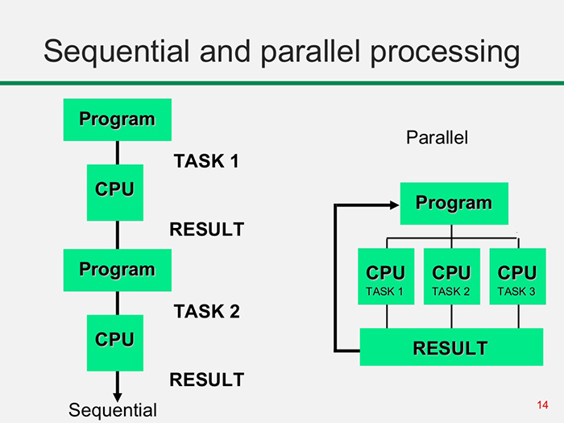

<style type="text/css">

body, td {
   font-size: 16px;
   font-family: sans-serif;
}
</style>
<html lang="en">

```{r setup, include=FALSE}
knitr::opts_chunk$set(echo = TRUE, warning = FALSE, message = FALSE)

knitr::opts_chunk$set(echo = TRUE)

```

# Introduction

This session is based on the **'Efficient R Programming'** textbook by Colin Gillespie and Robin Lovelace. There is also an associated Datacamp course which covers similar material.

{width=40%}

This session is an overview of some of the topics covered by the book. For more detail I encourage you to check out the book<sup>1</sup> and Datacamp course<sup>2</sup> yourselves.

1. Colin Gillepsie has made the book free to access on his [Github](https://csgillespie.github.io/efficientR/)

2. The associated Datacamp course can be found at this [link](https://app.datacamp.com/learn/courses/writing-efficient-r-code)


## What is efficient programming?

When we think about writing efficient code we usually think of it in terms of code that runs quickly. Whilst this is true, efficient programming can also mean writing well documented code that is easy to understand and debug. 

Writing inefficient code is not going to be much of  a problem when the analysis or size of the data is relatively small. But if you develop code using small datasets and extend them to larger ones, the small inefficiencies in your code can quickly add up and cause problems. 

In this session we will cover some useful tips that you can use whenever you write R code to help make your it easier to read and quicker to execute.


## Loading in the packages

The first thing we need to do is load in all of the required packages. I like to use `{pacman}` to help me with this as it will automatically install packages if they don't already exist. 

```{r package_loading}
#Check if pacman is installed or not.
#If it is missing install the package
if (!("pacman" %in% installed.packages()))
{
  install.packages('pacman')
}

#Load in the packages using the p_load() function
pacman::p_load('microbenchmark',
               'parallel',
               'compiler')

```

# Improving your code's performance

## Growing a vector (The cardinal sin of writing R code)

R is a great language for those wanting to analyse and apply statistical methods to data. It offers users the flexibility to solve problems in any way that they would like. The flexibility R offers is a double edged sword, with both advantages and disadvantages. By giving users so much flexibility it makes it easy for inefficient code to be introduced.

If you only take one thing from this session then let is be this: **Never grow a vector!**

Growing a vector is considered a cardinal sin when writing R code. If you need to loop over your data and store a result during each iteration then it is important that you allocate memory to the object storing the data beforehand.

The example below illustrates the issue caused by growing a vector.

### Creating a sequence of numbers 

In the example below there are 3 functions that create a sequence of numbers from 1 to n.

The function `fun1()` loops through the numbers and on each iteration appends the new value to the end of the variable `vec`. **This is an example of growing a vector** as on each iteration `vec` changes size.

In `fun2()` we repeat what we did previously only now we allocate memory to the resulting vector before looping through the sequence. Instead of growing a vector we are now simply assigning values to each element of the vector.

Finally `fun3()` uses one of the built-in R functions to generate a sequence.


```{r vector_growing, echo=TRUE}

#Loop through the numbers and on every iteration append the value to the end
#On each iteration grow the vector
fun1 = function(n) {
  vec = NULL
  
  for (i in 1:n) {
    vec = c(vec, i)
  }
}

#Loop through the numbers and on every iteration assign the value to a vector element.
#Create a blank vector of the correct size and then assign the value to the correct index.
fun2 = function(n) {
  vec = vector(length = n)
  
  for (i in 1:n) {
    vec[i] = i
  }
}

#Use R's bulit-in function to create sequences of numbers.
fun3 = function(n) {
  1:n
}


```

To compare the performance of the three functions we will use the `{microbenchmark}` package. This package allows us to run each function a number of times and records the median time for execution to complete. 

Lets compare our three functions by creating a sequence of numbers between 1 and 1000. Notice in the code that we use the scientific notation of `1e3` as short hand for 1000.  

```{r benchmark_vector_growing}
#Set the sequence length
n = 1e3

#benchmark each of the three functions
microbenchmark(fun1(n), fun2(n), fun3(n), times = 1, unit = 's')

```

When we only need to create a sequence of values up to 1000 all three functions run in less than 1 second.

The fastest function to run, `fun3()`, took advantage of the built-in sequence command. It ran over **280 times faster** than the slowest method where we grew the vector `fun1()`. 

You may have noticed that all functions ran in a fraction of a second. You may also be wondering if that is the case then why bother choosing the fastest. The answer becomes clear when the sequence size increases.


Instead of creating a sequence of numbers up to 1000 we now want to create a sequence up to 100,000. Again we will use scientific notation to denote this `n=1e5`.


```{r benchmark_vector_growing_v2}

n = 1e5

microbenchmark(fun1(n), fun2(n), fun3(n), times = 1, unit = 's')

```

Our most inefficient function now takes several seconds to run whereas the other two still only take a fraction of a second. The fastest function now runs over **8800 times faster** than the slowest.

Growing a vector is inefficient because for each iteration we have to make a request for memory, which is slow compared to other processes.

**In short never grow a vector but instead pre-allocate the memory or use a built-in function.**


## Accessing data in a data frame.

One of the most common things someone using R may want to do is access some data from a table. Thanks to the flexibility of R there are several ways of accessing data from a table. Again, some methods are more efficient than other.


Suppose we have a small data frame of numbers and letters that we want to extract data from.


```{r example_df}

df = data.frame(v = 1:4, name = letters[1:4])

print(df)
```


There are a number of ways accessing a single element. Three examples are outlined below.

```{r example_df_access, eval=FALSE}
#Select the row and column index number
df[3, 2]

#Select the row index and column by name
df[3, 'name']

#Select the column by name and then the row index
df$name[3]
```

Using microbenchmark to compare these three approaches we can see that the third method is the most efficient.

```{r benchmark_df_access}

microbenchmark(df[3, 2],
               df[3, 'name'],
               df$name[3], times = 1, unit = 'micro')

```

The reason that the third approach runs 10 times quicker than the slowest is not immediately  obvious.

A data frame is a useful object as it can contain data of different data types. For example, in our data frame it has a column of numbers and a column of characters. This is great for us because all of the data is stored in the same object/place. But this comes at the cost of processing speed.

The first two methods filter by the row first and then the column. When filtering by the row first the interim object created is a dataframe and so is still has the associated speed penalty.

The third approach selects the column first, which results in a single data type. This can be converted into a vector (which gives a speed boost) and then filtered.


## Using matrices


Even when a single data type is present within the data frame the speed penalty still remains. This is because when using a data frame R always has to check for the presence of different data types.

When we only have numeric data we should be storing it as a matrix rather than a data frame. Again, you may ask what the point is and why learn this new way of storing data?

The answer again can be illustrated through an example. We start off by creating two identical objects with the only difference being that one is a data frame and the other a matrix.


```{r matrix}

df = data.frame(a = 1:4, b = 1:4, c = 6:9)

df


mat = as.matrix(df)

mat

```


Benchmarking their performance we can see that the matrix is 10 times quicker when selecting a column and 36 times quicker when selecting a row. 


```{r matrix_benchmark}

microbenchmark(df[, 2], mat[, 2], times = 1)

microbenchmark(df[2,], mat[2,], times = 1)


```

## Vectorising code

R leverages vectorisation. Vectorisation is a way of applying a function to every element at the same time.

For example, suppose we have a sequence of numbers and that we want to add the same number to every element. We could do it like this:

```{r vectorisation_code}
#Create a sequence from 1 to 100,000
#Notice we are using the built-in function to create the sequence.
x = 1:1e5

#create a function that adds the number 1 to every element of a vector
add_one = function(x) {
  #loop through every index of a vector and add the number 1
  for (i in seq_len(length(x))) {
    x[i] = x[i] + 1
  }
}

```

Or we could take advantage of R's vectorisation and simply write it like this:

```{r vectorisation_example_2}
#Create a sequence from 1 to 100,000
#Notice we are using the built-in function to create the sequence.
x = 1:1e5

x = x + 1
```

In this example taking advantage of R's vectorisation results in around a 48 fold speed boost. 

```{r vectorisation_benchmark_2}

x = 1:1e5

microbenchmark(add_one(x), x + 1, unit = 'micro', times = 1)

```

The reason for the speed boost is fairly straight forward. In our custom function to complete execution R has to call the +, [], []= functions a total of 100,000 times each. Even though the cost of doing so is small, when repeated many times the difference in speed is magnified.

### Dice rolling game

Here is a second example of code vectorisation. Suppose we are playing a dice game where  two players roll a dice. The player with the highest score wins the round. If we play N rounds can we figure out what our chance of winning is? If we wanted to write this in code we could write it as:

```{r dice_throwing_game}

#Simulate dice throwing game
dice_throwing_game = function(N) {
  #set counter of games won to zero
  times_won = 0
  
  #loop through every game...
  for (i in seq_len(N)) {
    #simulate a dice throw for player 1
    player1 = sample(c(1, 2, 3, 4, 5, 6), 1)
    
    #simulate a dice throw for player 2
    player2 = sample(c(1, 2, 3, 4, 5, 6), 1)
    
    #if the dice roll for player 1 is greater than player 2 add one to the counter
    if (player1 > player2) {
      times_won = times_won + 1
      
    }
  }
  
  #divide the number of games won by the total games
  times_won / N
}

```

Instead we could vectorise the code and simulate the N rounds in a single function call and compare every round with a single function call.

```{r dice_throwing_game_vec}

dice_throwing_game_vec = function(N) {
  #simulate all games for player 1
  player1_rolls = sample(1:6, N, replace = TRUE)
  
  #simulate all games for player 2
  player2_rolls = sample(1:6, N, replace = TRUE)
  
  #compute how often player 1 wins and divide by the total
  sum(player1_rolls > player2_rolls) / N
}


```


```{r benchmark_dice_throwing}
#Simulate 100,000 games
N = 1e5

#Benchmark both approaches
microbenchmark(dice_throwing_game(N), dice_throwing_game_vec(N), times = 1)


```

## Introducing the apply family of functions

Around 10 years ago using a for loop in R was very inefficient. Since then significant improvements have been made to reduce the drop in performance caused by looping through the data. When loops were very inefficient a family of functions were created to speed up processing. These are the apply functions!

There are several functions in this family but in this session we will only consider two, `apply()` and `sapply()`.

The apply function is typically used on data frames and matrices when you want to repeat something to all of the columns or rows. For example, getting the column and row means of a matrix can be done by running the below code:

```{r apply_functions}

df = data.frame(a = 1:4, b = 1:4, c = 6:9)

mat = as.matrix(df)

#get the column means
apply(mat, 2, mean)


#get the row means
apply(mat, 1, mean)

```

This is not only quicker to run than a traditional for loop but is quicker to write and can be easier to read.


The next function we will look at is the sapply function. This function is very similar to a for loop, returning a vector or matrix of results.

```{r sapply_function}

dice_roll = vector(length = 100)

for (i in 1:100) {
  dice_roll[i] = sample(1:6, 1)
}


dice_roll_apply = sapply(1:100, function(i)
  sample(1:6, 1))

```


## Caching results


Suppose that you have to loop through the data and perform a task on every iteration. For example suppose that you want to divide the column means by the total standard deviation of the table.

The total standard deviation remains constant on every iteration. Does it make sense to compute on each iteration or compute it once and cache the results?

By saving the value to a variable we can reduce the number of function calls and so speed up the loop.

```{r loading_data}

#Load in a large matrix of values
ex_mat=readRDS('./data/example_matrix.rds')

ex_mat_csv=as.matrix(read.csv('./data/example_matrix.csv'))


microbenchmark(readRDS('./data/example_matrix.rds'),
               as.matrix(read.csv('./data/example_matrix.csv')),times=1,unit='s')


```


```{r result_caching}

#Notice that we have 1000 rows and 100 columns
dim(ex_mat)


#compute the table standard deviation
cached_sd = sd(ex_mat)

#Benchmark the calculation times using cached vs uncached results.
microbenchmark(apply(ex_mat, 2, function(i)
  mean(i) / sd(ex_mat)),
  apply(ex_mat, 2, function(i)
    mean(i) / cached_sd),times= 1)


```


## Parallel Computing

**If you are running this on Posit you wont be able to complete Section 2.7. The free version is limited to a single core.** 

In recent years the processing speed of a CPU has tapered off to a near stand still. The reason? The quicker a CPU processes information the more heat it generates. 

The problem now becomes how do we cool these high performance CPU? So if we can't create more powerful CPUs how can we improve the performance of a computer?

We could add multiple of them to help process though tasks quicker. Leveraging multiple cores to complete a task is called parallel processing.

{width=80%}  

<br/><br/>
Unfortunately R is single-threaded meaning we are only running our code on a single core. 

Luckily we can use some packages to help us access the other cores and give our code a big speed boost.

In the R package `{parallel}` we can use the function `detectCores()` to see how many cores we have on our machines. 


```{r parallel_cores}

paste0('Number of cores: ', detectCores())


```


On my laptop there are a total of 8 cores which in theory means I can make a piece of code run eight times faster. However we usually reserve one core to run other tasks. After all, if you are running code you still want to have access to your emails and Teams messages. 


It is also important to note that not all code can be run in parallel. There are two things to be mindful of:

1. Do the results for a single iteration depend on any others?

2. Can the loop be run forwards and backwards and get the same result?

If you answered **NO** the the first point and **YES** to the second then there is a good chance you can run your code in parallel.


Taking the below code as an example can we identify whether or not it can be run in parallel?


The code depicts a dice game where the player gets 100 rolls of the dice. After every roll they add the score to the total. A player wins the game if their total score exceeds 200. If the player rolls the same number three times in a row their total score goes back down to zero.

Can we run this code and simulate the dice throwing game in parallel?

```{r dice_roll_parallel_check}


#Dice rolling game
dice_game = function(n_rolls = 100) {
  #intial score
  total = 0
  
  #simulate rolls of a dice
  dice_rolls = sample(1:6, n_rolls, replace = T)
  
  #add the first two rolls
  total = sum(dice_rolls[1:2])
  
  #for every remaining roll...
  for (i in 3:n_rolls) {
    #check to see if it is the same as the previous two rolls
    if (dice_rolls[i] == dice_rolls[i - 1] &&
        dice_rolls[i] == dice_rolls[i - 2]) {
      #if it is reset the total to 0
      total = 0
      
    }
    else{
      #otherwise add the score to the total
      total = total + dice_rolls[i]
      
    }
    
    if (total >= 200) {
      #"Congratulations you are a winner!"
      return(1)
    }
    
    
  }
  
  #"Sorry you didn't win this time"
  return(0)
  
}


```
We **can't** run this code in parallel because it depends on the previous iterations. The constraint that 3 consecutive rolls with the same number resets the score to 0 prevents us from running the code in parallel. 

But what about if we want to simulate this game many times and then estimate how often we win. Can we run this in parallel?

```{r parallel_function}


N_games = 1e5

#create a preallocated vector
game_win_or_lose = vector(length = N_games)

#for every game...
for (i in seq_len(N_games)) {
  #simulate the game with 100 dice rolls
  game_win_or_lose[i] = dice_game(100)
}

mean(game_win_or_lose)

```


To run code in parallel we will use the parallel package. As we want to get the results back as a vector we will use the `parSapply()` function.

We first create a cluster with the number of cores we want. We will then tell the cluster what data and functions we want so that every core gets its own copy. 

Once the code has finished executing it is important to close the cluster to free up the used resources.

```{r run_code_in_parallel}

n.cores <- detectCores()

#setup a cluster
clust <- makeCluster(n.cores - 1)


# Export the dice_game() function to the cluster
clusterExport(clust, "dice_game")

# Re-write sapply as parSapply
res <- parSapply(clust, 1:100, function(i) dice_game())

mean(res)

#Close down the cluster
stopCluster(clust)
```


But how much of a speed boost does this give us? We would expect it to be 7 times quicker if we are using 7 cores.


```{r benchmark_parallel}

clust <- makeCluster(n.cores - 1)

# Export the play() function to the cluster
clusterExport(clust, "dice_game")

microbenchmark(for (i in seq_len(N_games)) {
  game_win_or_lose[i] = dice_game(100)
},
parSapply(clust, seq_len(N_games), function(i)
  dice_game()),
times = 1)

stopCluster(clust)

```

In actuality we only see about a 3.4 fold speed up. This is because each core needs to talk to each other and bring the data back once completed. This additional overhead can slowdown the parallel process. 

There is also another consideration to make. If working with large data you should be mindful. Each core needs a copy of the data so if you want to use a 2GB table on 7 cores you would need 14GB of RAM. If you use too much RAM relative to what is available you run the risk of code running slowly, programs not responding or crashing.


## Byte Compiling

Many of the native R functions run quickly because they are pre-compiled into byte code. This allows the function to be run outside of R by a very fast interpreter. 

If we create a custom function we could get a speed boost by simply compiling the code. To do this we use the `{compiler}` package.

Suppose we want to compute the mean of a vector. We could use the native `mean()` function. Instead we will write an inefficient custom function.

```{r}

mean_r = function(x) {
  m = 0
  n = length(x)
  for (i in seq_len(n)) {
    m = m + x[i] / n
  }
  m
}

```

We can then pre-compile our custom function and see how well it performs.

```{r}


cmp_mean_r = cmpfun(mean_r)
```


Naturally, the built-in function is the fastest. But the pre-compiled custom function is the second quickest. It should be noted that byte compiling code doesn't always result in a performance improvement.
```{r}

#Let's generate random data
x = rnorm(1000)

microbenchmark(mean_r(x), cmp_mean_r(x), mean(x), times = 1)

```


# Writing code that can be understood

## Descriptive naming

Sometimes when writing code we can get complacent, quickly assigning random variables names out of convenience.

How often have you assigned a variable as `x` out of convenience? How often have you come back to your code and forgotten what `x` corresponds to?


This can be problematic for collaborators and even yourself down the line. Take the below table as an example. Here I have quickly created the data without any consideration that others will need to understand it. 

Can you tell what the data is supposed to represent?


```{r df_poor_naming}
df = data.frame(
  c1 = 1:12,
  c2 = c(4.6, 6.5, 7.5, 8.9, 12.8, 14.9, 18.1, 18.3, 14.3, 12.7, 8.9, 3.5),
  c3 = c(4.9, 6.2, 6.8, 8.4, 12.3, 16.7, 16.1, 16.2, NA, NA, NA, NA)
)


df
```

What about now? In the below example I have given the table a more appropriate name and changed the column names to something more descriptive.

```{r df_good_naming}
avg_england_temp = data.frame(
  'Month Number' = 1:12,
  'Air Temperature 2022' = c(4.6, 6.5, 7.5, 8.9, 12.8, 14.9, 18.1, 18.3, 14.3, 12.7, 8.9, 3.5),
  'Air Temperature 2023' = c(4.9, 6.2, 6.8, 8.4, 12.3, 16.7, 16.1, 16.2, NA, NA, NA, NA)
)


avg_england_temp
```

It is now a lot clearer that this table contains the average air temperature in England for the years 2022 and 2023.


### Multi-word variables

When creating multi-word variables it is important to use a naming convention that is easy to understand. Using Camel Case, Snake Case or Dot Case are good examples of naming conventions.


```{r naming_conventions}

avgglobaltemp = 10

#Example of Camel Case
avgGlobalTemp = 10

#Example of Snake Case
avg_global_temp = 10

#Example of Dot Case

avg.global.temp = 10

```

Hopefully you can agree that any of the three naming conventions are better than no naming convention at all.

## Commenting Code

There is no point writing the most elegant code possible if you can't remember what it does six months down the line.

There are no hard and fast rules when it comes to commenting code. There is no need to comment every line but equally there should be enough comments to understand logic behind the code.

For example suppose we have the following code:

```{r poor_code_comments}

if(sample(0:36,1)==sample(0:36,1)){print("You're a Winner")}else{"You've Lost"}


```

Is it clear what the code is doing?

```{r code_commenting}

#simulate a game of roulette using the sample function 
if(sample(0:36,1)==sample(0:36,1)){print("You're a Winner")}else{"You've Lost"}


```

We have a good level of comments to make it clear what the code is doing. Below is an example of over commenting your code and providing too much detail.


```{r too_many_comments}
#The if statement tests some logic
#The first sample function simulates someone choosing a number
#The second sample functino simulates a spin of the roulette wheel.
#If the values match then the logic dictates that we print "You're a Winner"
#If the values don't match then we print "You've Lost"
if(sample(0:36,1)==sample(0:36,1)){print("You're a Winner")}else{print("You've Lost")}


```

## Indenting your code 

Another way to make your code easier to understand is to use indentations. Rather than writing all of your code on a single line and single column we can space things out.


Take this code as an example:

```{r unindented_code}

final_result=0
for(i in 1:12){if(i<=6 & sample(1:100,1)>70){final_result=final_result+1}else{final_result=0}}


```

We can first split these into separate lines:

```{r newline_code}

final_result=0

for(i in 1:12){
if(i<=6 & sample(1:100,1)>70){
final_result=final_result+1}
else{final_result=0}}


```

Then we should add comments where appropriate.

```{r newline_code_commented}

#initialise the score of a game
final_result=0

for(i in 1:12){

#test if the index is less than or equal to 6 and the random number is greater than 70  
if(i<=6 & sample(1:100,1)>70){
final_result=final_result+1}
else{final_result=0}}


```

And then we can indent the code so we know where the loop and if statement ends. To indent the code use the TAB button to shift the line of code. Normally R will try and help when writing code and indent for you.

```{r indented_code}
#initialise the score of a game
final_result=0

for(i in 1:12){
  #test if the index is less than or equal to 6 and the random number is greater than 70
  if(i<=6 & sample(1:100,1)>70){
          final_result=final_result+1}
  else{
    final_result=0}
  }


```

As a shortcut you can highlight your code and press `Ctrl + Shift + A` to automatically reformat the code.


```{r shortcut_code, echo=FALSE}

final_result=0
for(i in 1:12){if(i<=6 & sample(1:100,1)>70){final_result=final_result+1}else{final_result=0}}


```


# Final Remarks

There are no strict rules when it comes to writing efficient code.

- Some people will tell you that if the code works just wait for it to run, or use a more powerful machine.

- Others will say that every line should be scrutinised in detail to get the maximum performance.

Whenever writing code I like to find the balance between compiling speed and the time it takes to write the code:

- If the code is going to be run repeatedly or on large volumes of data then I will dedicate time to finding bottlenecks and improving the performance.

- If it is only being run once or for small quantities of data I will usually check for any glaring issues but not spend any considerably time refining the code.

But again, this is not a strict rule. Different projects and pieces of work demand different performance considerations.


Hopefully this session has introduced you to some simple techniques that could improve your code's performance in current or future pieces of work. If you have any questions or want to discuss something in more detail please don't hesitate to get in touch with the DALL team at: *datalab@nhsbsa.nhs.uk*

Thanks!
