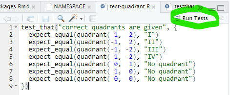

## Introduction

This session of Coffee & Coding is intended as a quick introduction to R packages. First we will look at what a package is and the benefits of creating one. Following this many of the development tools that can aid in writing a package will be introduced. Finally, a 'toy' package will be built that uses these tools and demonstrates the considerations to be made when writing an R package.

### What is an R package?

An R package is a collection of code (and potentially data) that is organised in a specific structure. R packages are best created following certain conventions. By using these conventions it is possible to leverage tools to automate some of the development tasks.

You may be familiar with the **C**omprehensive **R** **A**rchive **N**etwork (CRAN). This is the source of most of the R packages you will work with. There are currently `r format(nrow(available.packages()), big.mark=",")` packages on CRAN. The bar for a package to be listed, and remain on, CRAN is set quite high. Luckily, you don't need to submit a package to CRAN in order to distribute it. Packages can be shared in several ways. The best way of making a package available is to create a GitHub repository for it.

### Why would you want to create an R package?

A well-written R package benefits all sorts of people. You code can be used by others, without needing to 'see' and understand it. It will have documentation describing everything that can be done with the package and how to use it. Also, if someone wants to re-use and build upon your code, following standard package development conventions will reduce the effort needed. There will be tests that are run automatically, which will help you debug issues during development. You will also be able to leverage tools to automate some of the development tasks.

If you perform data analysis in R, writing a package to ingest data, run analysis code and produce outputs will lead to a nice side benefit. You may have heard the term [**R**eproducible **A**nalytical **P**ipeline (RAP)](https://nhsdigital.github.io/rap-community-of-practice/introduction_to_RAP/what_is_RAP/). According to NHS Digital, a RAP is

> RAP is a set of principles and working practices that help you create faster, more robust, and more transparent analytical processes.

A well written R package for your analysis, that is openly available on GitHub, meets a lot of the desired properties of a RAP.

**Baseline (aka Bronze) RAP** `r emo::ji("3rd_place_medal")` - minimum requirements to be a RAP:

Comes for 'free'

|        `r emo::ji("white_check_mark")` Data produced by code in an open-source language (R)
|        `r emo::ji("white_check_mark")` Code is version controlled (git)
|        `r emo::ji("white_check_mark")` Code is published in the open (GitHub)

<br> Little extra effort

|        `r emo::ji("ballot_box_with_check")` Code is linked to from accompanying publication (simple!)
|        `r emo::ji("ballot_box_with_check")` README.md file that details steps a user must follow to reproduce the code (can be challenging when data used is not publicly available)

<br> Small to moderate extra effort

|        `r emo::ji("ballot_box_with_check")` Code has been peer reviewed (as it should be, package or not)

<hr style="border: none; background-color: grey; height: 2px;">

**Silver RAP** `r emo::ji("2nd_place_medal")` - implementing best practice:

Comes for 'free'

|        `r emo::ji("white_check_mark")` Code is well-documented including user guidance and function documentation (helped by `{roxygen2}`)
|        `r emo::ji("white_check_mark")` Code is well-organised following standard directory format
|        `r emo::ji("white_check_mark")` Reusable functions and/or classes are used where appropriate
|        `r emo::ji("white_check_mark")` Code adheres to agreed coding standards (`{styler}` and `{lintr}` can be integrated into workflow and Continuous Integration (CI) on GitHub)
|        `r emo::ji("white_check_mark")` Repository includes dependency information (`DESCRIPTION` file)

<br> Moderately extra effort, supported by package development tools

|        `r emo::ji("ballot_box_with_check")` Pipeline includes a testing framework (with `{testthat}`)
|        `r emo::ji("ballot_box_with_check")` Explanation of code structure & methodology (distinct from 'usage' documentation, one way is to write package vignettes, or it could be part of an analysis write-up)

<br> Little direct cross-over with package development

|        Outputs are produced by code with minimal manual intervention (CI)
|        Logs are automatically recorded by the pipeline to ensure outputs are as expected
|        Data is handled and output in a [Tidy data format](https://vita.had.co.nz/papers/tidy-data.pdf)

<hr style="border: none; background-color: grey; height: 2px;">

**Gold RAP** `r emo::ji("1st_place_medal")` - analysis as a product:

Comes for 'free'

|        `r emo::ji("white_check_mark")` Code is fully packaged

<br> Little extra effort

|        `r emo::ji("ballot_box_with_check")` Repository automatically runs tests etc. via CI/CD (GitHub Actions)
|        `r emo::ji("ballot_box_with_check")` Changes to the RAP are clearly signposted (such as a changelog and release notes)

<br> Little direct cross-over with package development

|        Process runs based on event-based triggers (e.g., new data in database) or on a schedule.

## Tools

Writing an R package does come with additional overhead during development. The good news is that a lot of this can be automated and managed with various tools in the R package ecosystem. Some of these are even built into or offer addins for Rstudio.

### devtools

[`{devtools}`](https://devtools.r-lib.org/) is akin to `{tidyverse}`. Whereas the latter allows for quickly loading packages used for data exploration and visualization, `library(devtools)` will load packages used for package development. The sub-packages include `{usethis}`, `{roxygen2}` and `{testthat}`, among others.

### usethis

[`{usethis}`](https://usethis.r-lib.org/index.html) automates repetitive tasks that arise during package development. Some use cases include:

-   initial creation of a new R package
-   creation of various files such as licenses, R files and associated test setup

### roxygen2

[`{roxygen2}`](https://roxygen2.r-lib.org/) generates package documentation and metadata from comments in your code. The comments can include tags for specific sections of a function's documentation, such as:

-   @param - describe the purpose of a function argument and what format it should be
-   @export - tells roxygen2 that a function can be called by a user of the package
-   @examples - provides examples to show how to use the function

### testthat

[`{testthat}`](https://testthat.r-lib.org/) is the most popular unit testing package for R and is used by thousands of CRAN packages.

-   Provides functions that make it easy to describe what you expect a function to do.
-   Easily integrates into package development workflows.
-   Displays test progress visually, showing a pass, fail, or error for every expectation.

### styler

[`{styler}`](https://www.tidyverse.org/blog/2017/12/styler-1.0.0/) formats R code according to a style guide. By default, it uses the [Tidyverse style guide](https://style.tidyverse.org/). Has an addin for Rstudio to:

-   style individual R and Rmd files
-   styles all R and/or Rmd files in a directory
-   styles the source files of an R package

### lintr

[`{lintr}`](https://lintr.r-lib.org/) performs static code analysis. It is great to use in combination with `{styler}`, as the default Tidyverse style will (99% of the time) fix any issues highlighted by `{lintr}`. Has an addin for Rstudio, with similar options to `{styler}`.

### covr

[`{covr}`](https://covr.r-lib.org/) will help you see exactly which parts of your code are covered by tests. This allows you to easily improve test coverage.

### R CMD check

[`R CMD check`](https://r-pkgs.org/r-cmd-check.html) is basically a suite of automated tests. It's purpose is to ensure a package is properly structured, check that certain good practices are in use and identify potential issues. Over 50 individual checks are made when this is run. It will also run any `{testthat}` tests. It can be time-consuming to run, so is something to use sparingly. It should be run before preparing to push updates to a package to GitHub.

### GitHub actions

[GitHub actions (GHA)](https://docs.github.com/en/actions) provide a convenient (and free!) platform for CI. They can be used for a multitude of use cases. Useful things for R packages include:

-   checking for leaked data with [gitleaks](https://gitleaks.io/)
-   style and lint files with `{styler}` and `{lintr}`
-   run `R CMD check`

## R package workflow

Consider the problem of determining which quadrant of the plane a point lies in.

```{r, echo=FALSE, out.width="30%", fig.cap="<br>The four quadrants of a Cartesian coordinate system<br><a href='http://creativecommons.org/licenses/by-sa/3.0/' title='Creative Commons Attribution-Share Alike 3.0'>CC BY-SA 3.0</a>, <a href='https://commons.wikimedia.org/w/index.php?curid=603366'>Link</a>"}
knitr::include_graphics("https://upload.wikimedia.org/wikipedia/commons/1/1a/Cartesian_coordinates_2D.svg")
```

We will create a package called `quadr` that provides functions concerning this problem. It will be simple in scope, so that the focus is on the workflow rather than the code itself. The mostly manual way of doing things is shown, as this helps to get an understanding of what is going on that using the various tools does not. Afterwards, a more streamlined workflow is shown using the tools.

### Simplest possible package

Suppose we have the functions below. They both take an x and y coordinate.

- `quadrant` returns the quadrant (as a Roman numeral), or a message that `(x,y)` is in no quadrant.
- `on_axes` returns `TRUE` or `FALSE`, according to whether `(x,y)` is on at least one of the axes.

Each function is defined in its own file for demonstration purposes, but these could well be in the same file as their purpose is related.

```{r, eval=FALSE}
# In quadrant.R
quadrant <- function(x, y) {
  if (on_axes(x, y)) return ("No quadrant")
  
  signs <- sign(c(x, y))                        # maps x, y to -1, 0 or 1
  signs <- sub("1", "+", sub("-1", "-", signs)) # replaces 1, -1 with +, -
  signs <- paste0(signs, collapse = "")         # get a single string of x, y signs
  
  switch (signs,
    `++` = "I",
    `-+` = "II",
    `--` = "III",
    `+-` = "IV"
  )
}

# In on_axes.R
on_axes <- function(x, y) {
  any(c(x,y) == 0)                              # If either x or y is 0, TRUE 
}
```

The simplest possible R package has the following requirements:

- R files are placed in a folder named `R`
- a file `DESCRIPTION` is in the package root directory
- the `DESCRIPTION` file is yaml format and specifies properties `Package` and `Version`, e.g. 

```
Package: quadr
Version: 0.1
```

Usually the package root directory is named the same as the package, so for our toy package it would be `quadr`. In order to have the package at different stages of development, each version will be saved as `quadr_n`, with n starting at 0 for the first minimal package.

The `quadr` package can now be installed by setting the working directory to `quadr_0` and running `devtools::install()`

```{r, eval=FALSE}
devtools::install()
```

```{r, echo=FALSE}
setwd("quadr_0")
devtools::install()
```

Once installed, the package can be loaded with `library()`, or functions invoked using `quadr::`.

```{r}
c(
  quadr::quadrant(1, 2),
  quadr::quadrant(-1, 2),
  quadr::quadrant(-1,-2),
  quadr::quadrant(1, -2),
  quadr::quadrant(1, 0)
)
```

If you want to try out your package-in-development, use `devtools::load_all()`. This simulates the steps of building and installing, and also loads the package. Note that the output `load_all()` simply tells you the package is loaded - it is faster than building and installing for real with `install()`.

```{r, eval=FALSE}
devtools::load_all()

quadrant(1, 2)
```

```{r, echo=FALSE}
setwd("quadr_0")
devtools::load_all()

quadrant(1, 2)
```

### Adding documentation

The next step is to add documentation. This is done by including comments in a specific way, alongside the code. Being able to write the documentation for a function alongside the code is very helpful for code maintenance. If something changes in the code, the doc comments are right there and can be updated if needed. By structuring the doc comments, it allows automatic creation of the accompanying documentation files in a human readable format. End users of the package can then access this using the `?function` command.

#### Meta-documentation

In addition to the actual function documentation, packages have metadata. This includes the `DESCRIPTION` file. There are quite a lot of different properties that can be specified. The example below adds

- a title and description for the package
- information about the package author
- a license
- what can be thought of as configuration options, such as encoding and `{roxygen2}` related options

```
Package: quadr
Title: Plane Quadrants Tools
Version: 0.1
Authors@R: 
    person("Some", "One", , "some.one@example.com", role = c("aut", "cre"))
License: Apache License (>= 2)
Description: Functions concerning plane quadrants.
Encoding: UTF-8
Roxygen: list(markdown = TRUE)
RoxygenNote: 7.3.1
```

Note that the license file should also be included in the package. We will skip adding that, but later see that this can be done automatically.

The version number in the `RoxygenNote: 7.3.1` entry should match the version of {roxygen2} you have installed. If you update that package, the entry here should also be updated.

#### Function documentation

With metadata added, we can now document the functions. For this, we add comments with [tags](https://roxygen2.r-lib.org/reference/index.html#tags) that are recognised by {roxygen2}. Note the special comment character used in front of each line, `#'`. This ensures {roxygen2} only considers intended comments.

The most common tags include

- `\@title`: short one-liner (if tag omitted first comment will be used as title)
- `\@description`: short description of the purpose of the function (if tag omitted the second comment will be used as description)
- `\@param`: describe a function input, giving acceptable input types and any further info to end user
- `\@return`: the presence of this tag determines whether a function is exported from the package (by adding to `NAMESPACE`)
- `\@examples`: R code that demonstrates how the function works

```{r, eval=FALSE}
# In quadrant.R

#' Get quadrant of `(x,y)` coordinates
#' 
#' The quadrant definitions are those found in
#'  [Wikipedia](https://en.wikipedia.org/wiki/Quadrant_(plane_geometry))
#'
#' @param x Numeric
#' @param y Numeric
#'
#' @return Quadrant specified in Roman numerals, or message that point is not in
#'  any quadrant.
#' @export
#'
#' @examples
#' quadrant(1, 2),  # "I"
#' quadrant(-1, 2), # "II"
#' quadrant(-1,-2), # "III"
#' quadrant(1, -2), # "IV"
#' quadrant(1, 0)   # "No quadrant"
quadrant <- function(x, y) {
  if (on_axes(x, y)) return ("No quadrant")
  
  signs <- sign(c(x, y))                        # maps x, y to -1, 0 or 1
  signs <- sub("1", "+", sub("-1", "-", signs)) # replaces 1, -1 with +, -
  signs <- paste0(signs, collapse = "")         # get a single string of x, y signs
  
  switch (signs,
    `++` = "I",
    `-+` = "II",
    `--` = "III",
    `+-` = "IV"
  )
}

# In on_axes.R

#' Is point `(x,y)` on an axis of the plane?
#' 
#' The point `(x,y)` lies on an axis if at least one of the coordinates is zero.
#'
#' @param x Numeric
#' @param y Numeric
#'
#' @return `TRUE` or `FALSE`, according to whether `(x,y)` lies on an axis
#' @export
#'
#' @examples
#' on_axes(0, 0) # TRUE, this is the origin
#' on_axes(1, 0) # TRUE, this is on x-axis
#' on_axes(0, 1) # TRUE, this is on y-axis
#' on_axes(1, 1) # FALSE
on_axes <- function(x, y) {
  any(c(x,y) == 0)                              # If either x or y is 0, TRUE 
}
```

With documentation added, we can use `devtools::document()` to create the files.

```{r, eval=FALSE}
devtools::document()
```

```{r, echo=FALSE}
setwd("quadr_1")
devtools::document()
```

These are created as `.Rd` files (`.Rd` means 'R documentation') in a folder named `man` (short for manual).

```{r, eval=FALSE}
list.files("man")
```

```{r, echo=FALSE}
setwd("quadr_1")
list.files("man")
```

An additional file `NAMESPACE` is also created. `NAMESPACE` specifies what is imported into and exported out of the package. In our toy package, we have no imports but 2 functions are exported.

```{r, eval=FALSE}
cat(readLines("NAMESPACE"), sep = "\n")
```

```{r, echo=FALSE}
setwd("quadr_1")
cat(readLines("NAMESPACE"), sep = "\n")
```

Note the message `# Generated by roxygen2: do not edit by hand`. The same message will be found in the `.Rd` files for function documentation. If you need to change anything in these files, just change the doc comments accordingly and then regenerate the documentation.

To check that everything is working as intended, we can `load_all()` the package.

```{r, eval=FALSE}
devtools::load_all()

?quadrant
```

```{r, echo=FALSE}
setwd("quadr_1")
devtools::load_all()

?quadrant
```

A preview of the documentation will be opened in the Help pane of Rstudio.

<center>
  
</center>

### Adding tests

If you would like an introduction to testing in R that goes a bit deeper, check out my previous session. For the purposes of this session I will be skimming over the subject of testing and just present how to add the necessary files to a package.

In order for `{testthat}` to work best for a package, the tests need to be included in a specific way.

- There is a `tests` folder in the package root directory.
- A `testthat.R` file is in `tests`, that loads `{testthat}`, the package being tested and finally runs the tests.
- Within the `tests` folder is another folder named `testthat`.
- All tests are in the `tests/testthat` folder.

For our toy package then, we create the `tests` folder and place in it `testthat.R` which contains

```
library(testthat)
library(quadr)

test_check("quadr")
```

Also we create the `testthat` folder and place in it a file `test-quadrant.R` which contains

```
test_that("correct quadrants are given", {
  expect_equal(quadrant( 1,  2), "I")
  expect_equal(quadrant(-1,  2), "II")
  expect_equal(quadrant(-1, -2), "III")
  expect_equal(quadrant( 1, -2), "IV")
  expect_equal(quadrant( 0,  1), "No quadrant")
  expect_equal(quadrant( 1,  0), "No quadrant")
  expect_equal(quadrant( 0,  0), "No quadrant")
})
```

When set up in this way, you can run the tests manually by a call to `devtools::test()`.

```{r, eval=FALSE}
devtools::test()
```

```{r, echo=FALSE}
setwd("quadr_2")
devtools::test()
```

Another way is to click the  Rstudio 'Run Tests' button while viewing the test file.

<center>
  
</center>

### Checking a package

In order for `{testthat}` to be available when checking the package, the following needs to be added to `DESCRIPTION`

```
Suggests: 
    testthat (>= 3.0.0)
```

```{r, eval=FALSE}
devtools::check()
```

The output is very verbose, since it is checking a lot of things! Below, the output has been trimmed down (indicated by two lines of `...`), with just some points of note left in.

- Package documentation is regenerated if needed.
- Package is 'built' (i.e. into an installable form).
- A temp folder is created and provided for the outputs of the check.
- `DESCRIPTION` is checked, including any dependencies specified.
- Checks package can be installed.
- Checks R code is readable and syntax-error free.
- The code provided in `\@examples` is run to ensure no errors.
- The tests specified under the `tests` folder are run.
- Finally, results are displayed.
    - Errors **must** be fixed, since package is uninstallable.
    - Warnings **should** be fixed, if at all possible, to not clutter the output on future runs, potentially making other issues harder to spot.
    - Notes also **should** be addressed if possible, but these are the least serious issues.

```
══ Documenting ═════════════════════════════════════════════════════════════════════════════════════════════════════════
ℹ Updating quadr documentation
ℹ Loading quadr
══ Building ════════════════════════════════════════════════════════════════════════════════════════════════════════════
...
...
══ Checking ════════════════════════════════════════════════════════════════════════════════════════════════════════════
...
...
── R CMD check ─────────────────────────────────────────────────────────────────────────────────────────────────────────
─  using log directory ‘/tmp/RtmpfqyxK2/file1a5286a7a4e/quadr.Rcheck’
...
...
✔  checking for file ‘quadr/DESCRIPTION’
─  this is package ‘quadr’ version ‘0.1’
─  package encoding: UTF-8
✔  checking package namespace information
✔  checking package dependencies ...
✔  checking if this is a source package ...
...
...
✔  checking whether package ‘quadr’ can be installed (1.4s)
...
...
✔  checking R files for non-ASCII characters ...
✔  checking R files for syntax errors ...
✔  checking whether the package can be loaded (346ms)
✔  checking whether the package can be unloaded cleanly ...
✔  checking whether the namespace can be unloaded cleanly ...
...
...
✔  checking dependencies in R code (517ms)
...
...
✔  checking R code for possible problems (3.3s)
✔  checking Rd files ...
...
...
✔  checking for unstated dependencies in examples ...
✔  checking examples (796ms)
...
...
─  checking tests ...
✔  Running ‘testthat.R’ (596ms)
...
...
   
── R CMD check results ────────────────────────────────────────────────────────────────────────────────── quadr 0.1 ────
Duration: 15.6s

0 errors ✔ | 0 warnings ✔ | 0 notes ✔
```

### Adding CI

## Using packages from GitHub

## Resources

-   R packages (Whickam)
-   Enterprise Shiny (ThinkR)

## Questions?
