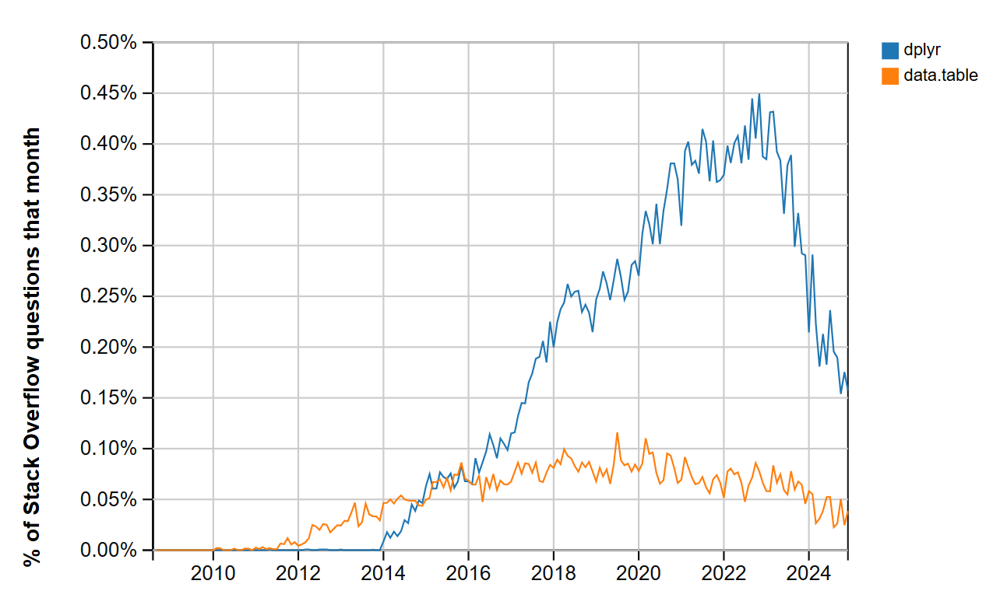

```{r setup, include=FALSE}
knitr::opts_chunk$set(
  echo = FALSE,
  warning = FALSE,
  message = FALSE
)

library(data.table)
library(dplyr)
library(microbenchmark)
```

# Part I

## Introduction

Not to be confused with the package *DT*, which is an interface to a JavaScript library *DataTables*. *data.table* objects are conventionally labelled *DT*.

*data.table* is the 2nd most popular R package for data manipulation after *dplyr*.



The main selling-point of *data.table* is the efficiency of code execution. While *dplyr* is considered by many more readable, *data.table* syntax is much less so, especially for newbies, but it is generally more succinct.

```{r}
df <- iris

DT <- as.data.table(iris)

class(df)
class(DT)
```

*data.table* is a class that inherits from *data.frame*. Any syntax that works on a *data.frame* will also work on a *data.table*. But *data.tables* additionally support own enhanced syntax.

## Basics: the DT[i, j, by] syntax

```{r}
head(iris) # 50 rows x 3 species = 150 rows in total
```

Filtering in *i*

```{r}
df |> filter(Petal.Length > 1.5)
```

```{r}
DT[Petal.Length > 1.5]
```

*Note, in the console, use of head() is not necessary with data.tables to avoid a large output, since it is automatically limited to the top 5 rows and bottom 5 rows.*

Selecting rows by index.

```{r}
df[1:2,]
```

```{r}
DT[1:2] # Comma can be included, but is redundant
```

Selecting or computing in *j*

```{r}
df |> select(Species, Petal.Width)
```

```{r}
DT[, .(Species, Petal.Width)]  # The dot is data.table's shorthand for list()
```

```{r}
# Alternative
DT[, c("Species", "Petal.Width")]
```

Selecting a vector

```{r}
df |> pull(Petal.Width) |> head()
```

```{r}
DT[, Petal.Width] |> head()
```

Simple row-wise computation

```{r}
df |> mutate(Petal.Area = Petal.Length * Petal.Width) |> select(Petal.Area)
```

```{r}
DT[, .(Petal.Area = Petal.Length * Petal.Width)] # j mutates and selects in one go
```

Advanced row-wise computation

```{r}
# Return a single TRUE/FALSE based on whether anything in the argument matches "setosa"
# (Not the best approach to flagging, but just to illustrate non-vectorised functions)

flag_setosa <- function(x) {
  any(stringr::str_detect(x, "setosa"))
}

flag_setosa("setosa")
flag_setosa("versicolor")
```

```{r}
df |> 
  mutate(Flag = flag_setosa(Species)) |>
  group_by(Species, Flag) |>
  summarise(N = n())

# Wrong result: non-vectorized function applied to a vector.
# Takes the whole Species vector and returns TRUE if at least one value matches "setosa", which it does.
```

A powerful way to use non-vectorised functions in row-wise calculations is by using the `rowwise()` adverb in *dplyr*.

```{r}
df |>
  rowwise() |> # Implicitly groups by row
  mutate(Flag = flag_setosa(Species)) |>
  group_by(Species, Flag) |>
  summarise(N = n())
```

*data.table* achieves the same using `by=.I`, where `.I` is a special symbol indicating row number. Also note, `.N` is *data.table*'s special symbol for row count.

```{r}
DT[, .(Species, Flag = flag_setosa(Species)), by=.I][, .N, by=.(Species, Flag)]
```

Aggregation

```{r}
df |> summarise(Mean.Petal.Length = mean(Petal.Length))
```

```{r}
DT[, .(Mean.Petal.Length = mean(Petal.Length))]
```

Grouping in *by*.

While *i* and *j* can be used on their own, *by* can only be used with *j*.

```{r}
df |> filter(Petal.Length > 1.5) |>
      group_by(Species) |>
      summarise(Mean.Petal.Length = mean(Petal.Length))
```

```{r}
DT[Petal.Length > 1.5, .(Mean.Petal.Length = mean(Petal.Length)), by = Species]
```

Grouping by multiple columns, including derived columns (+ ordering and chaining)

```{r}
df |> mutate(Bin = cut(Petal.Length, breaks = seq(0,8,2))) |>
      group_by(Species, Bin) |>
      summarise(N = n()) |>
      arrange(Species, Bin)
```

*data.tables* support named expressions on-the-fly in `by`.

```{r}
DT[, .N, by = .(Species, Bin = cut(Petal.Length, breaks = seq(0,8,2)))][order(Species, Bin)] # compound statement
```

In the above example, one `DT` chain link replaces four *dplyr* pipes.

Group counter and the number of groups.

```{r}
df <- df |> group_by(Species)

df |> summarise(
  GRP = cur_group_id(),
  NGRP = n_groups(df),
  PERCENTAGE_OF_GROUPS_PROCESSED = GRP / NGRP * 100 )

df <- ungroup(df)

```

```{r}
DT[, .(.GRP, .NGRP, PERCENTAGE_OF_GROUPS_PROCESSED = .GRP/.NGRP * 100), by=Species]
```

Use a group's nominal value in calculation. (Example: at each petal width, sum all petal lengths multiplied by petal width)

```{r}
df |> group_by(Petal.Width) |>
      summarise(X = sum(Petal.Length) * pull(cur_group())) |>
      arrange(Petal.Width)
```

`.BY` is *data.table*'s special symbol representing nominal group value.

```{r}
DT[, .(X = sum(Petal.Length) * as.numeric(.BY)), by=Petal.Width][order(Petal.Width)]
```

#### More advanced computation in *j*

Computation on multiple columns at once

```{r}
df |> group_by(Species) |>
      summarise(across(c("Petal.Length", "Petal.Width"), mean))
```

*data.tables* have another special symbol, `.SD`, which stands for subset of data.

`.SD` can be treated as a *data.table* inside a *data.table*.

```{r}
DT[, .SD]
```

```{r}
DT[, lapply(.SD, mean), by = Species, .SDcols = c("Petal.Length", "Petal.Width")] 

# .SDcols is optional; when it is not specified, it defaults to all columns (other than those in 'by')
```

Include multiple types of aggregation in one statement.

```{r}
df |> group_by(Species) |>
      summarise(
        N = n(),
        across(everything(), mean)
      )
```

```{r}
DT[, c(.N, lapply(.SD, mean)), by=Species]  
```

Intermediate output

Variables inside `{}` are temporary anonymous variables. By default, only the last one of them is returned.

```{r}
# Variance calculated in steps
DT[, {mean_petal_length = mean(Petal.Length)
      var_petal_length = sum((Petal.Length - mean_petal_length)^2)/(.N-1)},
   by = Species]

# Equivalent to:
# DT[, var(Petal.Length), by=Species]
```

A list at the end of `{}` can be used to control which anonymous variables are returned.

```{r}
DT[, {mean_petal_length = mean(Petal.Length)
      var_petal_length = sum((Petal.Length - mean_petal_length)^2)/(.N-1)
      .(mean_petal_length, var_petal_length)},
   by = Species]
```

Example: calculate proportions of values above and below the mean in each species.

```{r}
df |> group_by(Species) |>
      mutate(Above.Mean = Petal.Length > mean(Petal.Length)) |>
      group_by(Species, Above.Mean) |>
      summarise(N = n()) |>
      group_by(Species) |>
      mutate(P = N/sum(N)) |>
      select(-N) |>
      arrange(Species, Above.Mean)
```

```{r}
DT[,
   {Total = .N;
   .SD[,
       .(P = .N/Total),
       by=.(Above.Mean = Petal.Length > mean(Petal.Length))]},
   by=Species][order(Species, Above.Mean)]

# DT version is more succinct and efficient, but less intuitive
```

The above example demonstrates a few important things.

-   The `.SD` works as data.table inside a data.table that has its own scope. The `.SD[i,j,by]` inside `DT[i,j,by]` effectively groups the aggregations inside the `.SD` by both `Species` and `Above.Mean`

-   The aggregation at an upper level grouped only by `DT`'s `by` is made available inside `.SD` via a temporary anonymous variable `Total`, which is available for use in `DT`'s `j` , including inside `.SD` .

Return records with the highest petal length by species

```{r}
df |> group_by(Species) |>
      slice_max(order_by = Petal.Length, n = 1)
```

```{r}
DT[, .SD[which(Petal.Length == max(Petal.Length))], by = Species]
```

Note, finding a record with highest value is not the same as using an aggregate `max()` by group, because there could be ties. If ties are not needed, `which.max()` returns one (first) row with the maximum value.

```{r}
df |> group_by(Species) |>
      slice_max(order_by = Petal.Length, n = 1, with_ties = FALSE)
```

```{r}
DT[, .SD[which.max(Petal.Length)], by = Species]
```

Find row indices which meet certain conditions, e.g. maximum values by species.

```{r}
df |> mutate(I = row_number()) |>
      group_by(Species) |>
      slice_max(order_by = Petal.Length, n = 1) |>
      select(Species, I)
```

*data.table* solution makes use of the special symbol `.I`

```{r}
DT[, .(I = .I[which(Petal.Length == max(Petal.Length))]), by=Species]

```

*j* is very general and is not limited to just aggregations.

For example, a multi-value output or even graphics. *dplyr* also supports this generality with `reframe()`.

For each species, concatenate 50 sepal length values and 50 petal length values into one 100-value column (so, a 150-row table becomes a 300-row table). This is achieved using base `c()`.

```{r}
df |> group_by(Species) |>
      reframe(All.Lengths = c(Sepal.Length, Petal.Length))
```

In *data.table*, this is handled natively.

```{r}
DT[, .(All.Lengths = c(Sepal.Length, Petal.Length)), by = Species]
```

Graphics

```{r}
par(mfrow = c(2, 2)) # Split plotting area into 2x2 grid

df |> group_by(Species) |>
      reframe(plot(Petal.Length, Sepal.Length, main = unique(Species)))
```

```{r}
par(mfrow = c(2, 2))

DT[, plot(Petal.Length, Sepal.Length, main = unique(Species)), by=Species]
```

## Re-naming and re-ordering columns

```{r}
df <- df |> rename(
  sepal_length = Sepal.Length,
  sepal_width = Sepal.Width
)

head(df)
```

```{r}
setnames(DT, c("Sepal.Length", "Sepal.Width"), c("sepal_length", "sepal_width"))

head(DT)
```

Note, unlike `rename()`, `setnames()` updates names in-place, without making a (shallow or deep) copy of the table in memory. This is its major selling-point.

```{r}

microbenchmark(
  
  dplyr = df |> dplyr::rename(
    xxx = sepal_length,
    yyy = sepal_width
  ),
  
  data.table = setnames(DT, 1:2, c("sepal_length", "sepal_width")),
  
  times = 1000L
  
) |> summary() |> select(expr, median_microseconds = median)
```

Difference is not noticeable on a table as small as `iris` with 150 rows, but will be appreciable in large datasets.

Re-name using a function.

```{r}
df <- df |> rename_with(
  ~ tolower(gsub(".", "_", .x, fixed = T))
  # fixed = T forces literal matching of the dot, as opposed to any character (regex)
)

head(df)
```

```{r}
setnames(DT, new = \(x) {tolower(gsub(".", "_", x, fixed = T))})

head(DT)
```

Re-order

```{r}
df <- df |> relocate("species", .before = 1)

head(df)
```

```{r}
setcolorder(DT, neworder = "species")

# neworder specifies one or more columns that will be placed in that order at the front of of the table

head(DT)
```

## Assignment operator

Change values in a subset of rows.

```{r}
df <- df |> mutate(
  species = case_when(
    species == "setosa" ~ "Iris setosa",
    T ~ species
  )
) 

df |> group_by(species) |>
      summarise(n = n())
```

```{r}
DT[species=="setosa", species := "Iris setosa"]

DT[, .N, by=species]
```

Again, the `:=` operator updates only those values that need to be changed by reference in-place, whereas *dplyr* solution overwrites the whole column using conditional substitution.

```{r}
microbenchmark(
  
  dplyr = df |> mutate(
            species = case_when(
              species == "setosa" ~ "Iris setosa",
              T ~ species
            )
          ),
  
  data.table = DT[species=="setosa", species := "Iris setosa"],
  
  times = 1000L
  
) |> summary() |> select(expr, median_microseconds = median)
```

Aggregate values in-place (Window functions in SQL)

```{r}
df |> group_by(species) |>
      mutate(mean_petal_length = mean(petal_length)) |>
      ungroup() |>
      slice_head(n = 2, by = species)
```

```{r}
DT[, mean_petal_length := mean(petal_length), by=species]

DT[, head(.SD, 2), by=species]
```

Updating multiple columns at once.

Round sepal length and width, but only in setosa.

```{r}
# dplyr solution involves multiple column re-creations

df <- df |> mutate(
  sepal_length = case_when(
    species == "Iris setosa" ~ round(sepal_length),
    T ~ sepal_length
  ),
  sepal_width = case_when(
    species == "Iris setosa" ~ round(sepal_width),
    T ~ sepal_width
  )
)

df |> slice_head(n = 2, by = species)

```

With `DT`, we can use two update statements, such as

`DT[species=="Iris setosa", sepal_length := round(sepal_length)]`

or, more efficiently, combine them into one using the functional form of the assignment operator.

```{r}
DT[species == "Iris setosa",
   `:=`(sepal_length = round(sepal_length),
        sepal_width = round(sepal_width))
   ]

# ...or using .SD/.SDcols, which may be the more succinct option when same function is applied repetitively to many columns

columns_to_modify <- c("sepal_length", "sepal_width")
DT[species == "Iris setosa", (columns_to_modify) := lapply(.SD, round), .SDcols = columns_to_modify]

DT[, head(.SD, 2), by=species]
```

Since *data.table v.1.15.0*, `let()` is a new alias for `` `:=`() ``.

The `:=` can also be used to delete columns.

```{r}
df <- df |> select(-sepal_length)

head(df)
```

```{r}
DT <- DT[, -"sepal_length"] # Similar solution to dplyr, overwrites the whole table

DT[, sepal_length := NULL] # Deletion in-place, a lot more efficient

head(DT)

```

## *data.tables* are copied as references

Changes in a data.frame copy are not reflected in the original object.

```{r}

df2 <- df

df2 <- df2 |> mutate(petal_width = petal_width * 100)

head(df)
head(df2)
```

Changes in data.table 'copy' are reflected in the original object, because `DT2 <- DT` does not create a deep copy, but only copies references to values in memory.

```{r}

DT2 <- DT

DT2[, petal_width := petal_width * 100]

head(DT)
head(DT2)
```

To create a deep copy of a data.table, we must use `DT2 <- copy(DT)`.

# Part II

## Keys and indices

*data.tables* support keys and indices, which help improve performance even further.

-   Keys don't have to have unique values
-   Keys may be set on one or multiple columns
-   Only one key per *data.table* can be set, because behind the bonnet the table is physically re-ordered by key in memory.

```{r}
setkey(DT, species)

# Check the key has been set
haskey(DT)
key(DT)
attributes(DT)$sorted # Key is stored in the attribute 'sorted'
```

Another convenience method of setting a key is to use `keyby` instead of `by`.

```{r}
DT[, .N, keyby=species] |> key()
```

Taking advantage of the key in filtering:

```{r}
# Recommended syntax
DT[.("Iris setosa"), on = .(species)]
DT[.("Iris setosa"), on = "species"]

# When a key is set, on= is optional, but recommended for explicitness
DT[.("Iris setosa")]           

# .() around the condition may be dropped, but not when the key is a numeric column
DT["Iris setosa"]

```

Keyed filters can be up to 1000 times faster than non-keyed filters, but there is an upfront cost of creating the key.

Although there can be no more than one key, *data.tables* support secondary indices, of which there can be more than one. Indices improve performance, but not as good as keys.

```{r}
setindex(DT, petal_length) # Stored in attributes(DT)$index

indices(DT)
```

```{r}
DT[.(5.0), on = .(petal_length)]
```

If we use this syntax on a column or columns that aren't covered by a key or an index, an index will be created on-the-fly for the purpose of execution, but won't be saved.

```{r}
DT[.(10.0), on = .(petal_width)]
```

Notice the syntax `DT[.("Iris setosa"), on = .(species)]` is reminiscent of a join (in fact, a right join). This method is indeed called a filter or a subset *as-a-join*. In this case, can be thought of as a join to a pseudo-table with 1 column and 1 row.

This syntax can, of course, be combined with *j* and *by*. Below, the special symbol `.EACHI` is used in *by*, which means grouping by whatever groups arise from the join in *i* (effectively by what is explicitly or implicitly in the `on=` clause).

```{r}
# Filter-as-a-join syntax
DT[!"Iris setosa", on = .(species), mean(petal_length), by=.EACHI]

# Same result using the standard syntax
DT[species!="Iris setosa", mean(petal_length), by=species]
```

Can also be combined with assignment in-place by reference:

```{r}
DT["Iris setosa", on = .(species), sepal_width := round(sepal_width)]

# sepal_width in setosa was already rounded in previous code chunks
```

Since this syntax results in a right join, if there are non-existing values in *i*, they will occur in the result.

```{r}
DT[.(c("XXX", "Iris setosa", "YYY")), on = .(species), .SD[1], by=.EACHI]
```

Above, output was limited to the first row in each group using `.SD[1]` and `.EACHI`. Same can be achieved using a convenience argument `mult`, which can be set to return either the "first" or the "last" row per group, in case of multiple matches.

```{r}
DT[.(c("XXX", "Iris setosa", "YYY")), on = .(species), mult = "first"]
```

The `nomatch` argument controls the output of 'preudo-rows' in *i* that do not match to anything in `DT`. By default, `nomatch=NA`, which returns non-matching rows with *NA* values. The alternative is *0* or *NULL*, which does not return non-matching rows (effectively turning a right join into an inner join).

```{r}
DT[.(c("XXX", "Iris setosa", "YYY")), .SD[1], by=.EACHI, on = .(species), nomatch = 0]
```

Rolling joins work only when the key is numeric.

```{r}
R <- data.table(
  number = c(4:6,10:12),
  letter = c(LETTERS[4:6], LETTERS[10:12]))

setkey(R, letter)

R
```

Suppose the range needs to be expanded.

```{r}
R[.(1:15), on = .(number)]
```

Several ways of using a rolling join to fill the blanks, e.g. last-observation-carried-fowrard.

```{r}
R[.(1:15), on = .(number), roll = Inf]
```

... or next-observation-carried-backward.

```{r}
R[.(1:15), on = .(number), roll = -Inf]
```

LOCF or NOCB, whichever is nearest. In case of ties, LOCF trumps NOCB.

```{r}
R[.(1:15), on = .(number), roll = 'nearest']
```

LOCF or NOCB only for a certain number of steps.

```{r}
R[.(1:15), on = .(number), roll = 2] # LOCF for 2 steps
```

```{r}
R[.(1:15), on = .(number), roll = -2] # NOCB for 2 steps
```

## Joins as filters

Above, filters were written as joins. This syntax naturally extends to proper joins of two data.tables.


```{r}
DT1 <- data.table(
  id = 1:5, letter = LETTERS[1:5]
)

DT2 <- data.table(
  id = 3:7, number = rnorm(4)
)

# Setting a key on 'id' is optional,
# but, if set, will greatly improve performance

DT1
DT2
```

Right join of DT2 to DT1.

```{r}
DT1[DT2, on = .(id)]
```

Left join of DT2 to DT1

```{r}
DT2[DT1, on = .(id)]
```

Inner join

```{r}
DT1[DT2, on = .(id), nomatch = 0]
```

Left anti-join

```{r}
DT1[!DT2, on = .(id)]
```

Right anti-join

```{r}
DT2[!DT1, on = .(id)]
```

Full join can be obtained as a union of (1) left join and right-anti join; (2) right join and left-anti join; (3) left-anti join, right-anti join and inner join

```{r}
rbind(
  DT2[DT1, on = .(id)],
  DT2[!DT1, on = .(id)],
  fill = TRUE
  )
```

Full anti-join can be obtained as a union of left and right-anti joins (not shown).

Joins can be combined with *j* and *by* in one statement.

```{r}
DT2[DT1, on = .(id), sum(number), by=.EACHI]
```

Alternatively, some joins can be done using a convenience function `data.table::merge()`

```{r, eval=FALSE}
merge(DT1, DT2, by="id", all.x = TRUE)  # Left join of DT1 to DT2
merge(DT1, DT2, by="id", all.y = TRUE)  # Right join of DT1 to DT2
merge(DT1, DT2, by="id", all = TRUE)    # Full join of DT1 to DT2
```

Non-equi joins

```{r}
# Prescriptions
P <- data.table(
  patient = LETTERS[1:2],
  presc_date = as.IDate("2024-01-01") |> rep(2)
)

# PPCs
CERT <- data.table(
  patient = LETTERS[1:2],
  cert_no = c(111,222),
  start_date = c(as.IDate("2023-01-01"), as.IDate("2000-01-01")),
  expiry_date = c(as.IDate("2025-01-01"), as.IDate("2000-01-02"))
)

P
CERT
```

```{r}
# Right join of patients to certificates
CERT[P, on = .(patient, start_date <= presc_date, expiry_date >= presc_date),
     .(patient, presc_date, x.cert_no, x.start_date, x.expiry_date)]
```

Here, if *j* wasn't included, the join would take values from `P` and names from `CERT`. Hence, certificate number, start and expiry dates need to be prefixed with `x.` to take the values from `CERT`.

## Melting and re-casting

Cast `iris` from long to wide format. Each species now has its own column.

```{r}

Wide_DT <- DT[, .(row_id = rowid(species), species, petal_length)] |> dcast(row_id ~ species, value.var = "petal_length")

Wide_DT

# Note: row_id is needed to have unique combinations of species x row.

```

Melt back to the long format.

```{r}
Long_DT <- melt(Wide_DT, id.vars = "row_id", measure.vars = c("versicolor", "virginica", "Iris setosa"),
                variable.name = "species", value.name = "petal_length")

Long_DT
```

This shows basic melting/casting, but more complex cases with multiple variables/values are possible, including many options.
