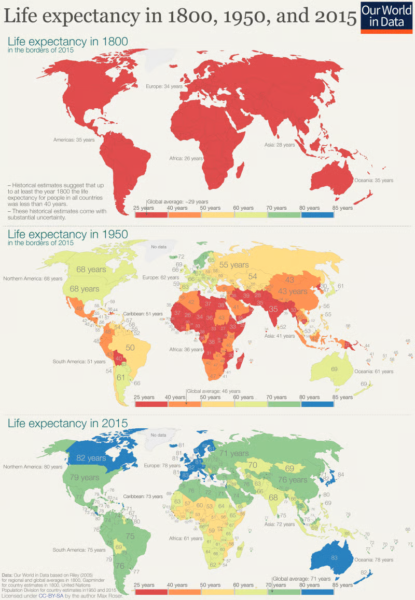

# Introduction to Data Visualisation in R

## What will I cover in this session?

-   **Why do we need to visualise data?**

-   **Why R?**

-   **Data exploration**

-   **Basic plotting using base R tools**

-   **Using `ggplot2` to create more customisable plots.**

-   **Creating interactive plots using `plotly` and `highcharter`**

## **1. Why is it so important to visualise data?**

1.  **To communicate our insights clearly:** 'A picture tells a thousand words.' We all hope to communicate with impact, and done well, data visualisation can be a really helpful tool to get a message across.



Max Roser (2018) - “Twice as long — life expectancy around the world” Published online at OurWorldinData.org. Retrieved from: '<https://ourworldindata.org/life-expectancy-globally>'

2.  **To support our insights with evidence:** we could tell the story of the data in words however it is a lot more believable for our audience when they can visualise the trends and allow them to use their own judgement. Plus it is a lot more engaging.
3.  **To uncover patterns and trends:** - if we were to simply look at summary statistics, or the results of a hypothesis test without plotting the data we might miss a huge part of the story. For example...

```{r, echo = FALSE, message = FALSE, warning = FALSE, fig.width=10}

library(datasauRus)
library(tidyverse)
library(ggplot2)

ggplot(filter(datasaurus_dozen, dataset %in% c("away", "wide_lines" , "dino")), aes(x = x, y = y)) +
  geom_point(color = "#2c3e50", size = 1.5, alpha = 0.8) +
  facet_wrap(~dataset, ncol = 3) +
  theme_bw(base_size = 14) +
  theme(
    strip.text = element_text(face = "bold"),
    axis.text = element_blank(),
    axis.ticks = element_blank()
  ) +
  labs(
    title = "Each dataset has nearly identical summary statistics, but plotting the data tells a different story.",
    x = NULL,
    y = NULL
  )

```

## **2. Why R?**

-   It is the language I know best!

-   R is a powerful language for statistical computing and graphics. There are loads of open source packages that allow different levels of customisation of charts, depending on your requirements.

-   Today I'll talk about some very popular packages `ggplot2`, `ggplotly` and `highcharter`, which allow for very detailed customisation of plots and interactive functions. A couple of years ago Graham and Adnan did C&Cs all about plotting data using `ggplot2` and `highcharter`. I will cover a little bit of the same ground but for more dedicated tutorials I would have a look at those (links at the end).

-   **Who is this for?** Anyone that has an interest in plotting data in R. I will start from extremely basic plotting and move on to more 'fancy' plots. So, if you are completely new to R and want to start using R for your visualisations I hope this C&C gives you a good place to start. However, if you are well versed in R but haven't used interactive plots before I hope this will be useful for you too. Regardless, if you feel like you might have anything to add please feel free to chime in in the chat and we can share our knowledge.

-   You don't have to use R, there are other tools and coding languages in which can do the same thing, some of them even share the same syntax across coding languages (`ggplot2` / `plotnine` in Python).

------------------------------------------------------------------------

## **3. Setting up: Installing and loading packages**

To keep things simple, I've tried to keep the packages to a minimum and we will be using one dataset all the way through, which is from the package `gapminder`. It contains global life expectancy data from 1952 - 2007 at 5 year intervals. We will use base R functions and 3 additional packages for the visualisations: `ggplot2`, `ggplotly` and `highcharter`.

```{r, message = FALSE, warning = FALSE}

#install.packages(c("NHSRtheme", "nhsbsaR", skimr", "gapminder",  "ggplot2", "plotly", "highcharter"))

# load packages:

# Helper packages
library(NHSRtheme) # for NHS colour palette
library(nhsbsaR)   # for NHSBSA ggplot and highcharter themes
library(skimr)     # for data summary statistics

# Plotting packages
library(ggplot2)
library(plotly)
library(highcharter)

# Dataset we will be using
library(gapminder)

```

## **4. Importing data and exploring**

### Importing Data

We can now load the data from gapminder:

```{r, message = FALSE, warning = FALSE}
# Let's load the data from the gapminder package:

data(gapminder)
```

### Before plotting, lets explore our dataset.

It's always a good idea to have a look at the data before you go ahead and plot it, just to see if there's anything that you need to consider. It might help you decide which type of plot to use.

We can have a quick look at data types, missingness and whether we suspect there may be any outliers or uneven distribution.

You could use the `summary()` function for this, however a function I prefer to use is `skim()` from the `skimr` package. Not only does it return standard summary statistics such as mean, standard deviation and quartiles, it gives you the proportion of missing data for each variable and even a (small) histogram so that you can have a quick look at the distribution too.

```{r}
skimr::skim(gapminder)

```

By summarising we can see that `gapminder` is a dataset of life expectancy values, gdp and population size (all numeric). The data can be grouped by country, continent and year.

## **5. Base R functions for basic plotting**

To explore the dataset we can have a look at some basic plotting functions.

-   To create a histogram, you can use the `hist()` function:

```{r}
hist(gapminder$lifeExp)
```

-   For an x by y plot of two numeric variables you can use the `plot()` function:

```{r}

plot(gapminder$gdpPercap, gapminder$lifeExp)

# it probably needs a logarithmic x axis:

plot(lifeExp ~ gdpPercap, data = gapminder, log = 'x')

# and a change of x axis label:

with(gapminder, plot(gdpPercap, lifeExp, log = 'x', xlab = "GDP per capita (Log-scale)"))


```

-   `boxplot()` for a boxplot

For the next few plots we will filter the `gapminder` dataset to the most recent year (2007) to simplify things:

```{r}

gap_2007 <- gapminder |> filter(year == 2007) # Filtering to a specific year

boxplot(
  lifeExp ~ continent,
  data = gap_2007
)


```

There are plenty of other base R plotting funtions too including barplot, pie, stripchart, line plots etc. For a good resource on base R plotting functions see here:<https://intro2r.com/custom_plot.html>.

### Customisation of basic plots

We have options to change some parameters to customise and tidy up the basic plots:

```{r}

boxplot(
  lifeExp ~ continent,
  data = gap_2007,
  pch = 2,  # symbols used for plotting points
  lty = 1,  # line type, solid, dash, dot-dash etc
  lwd = 3,  # linewidth
  col = "lightgreen", # fill colour
  border = "darkgreen", # border colour
  main = "Life Expectancy by Continent (2007)", # main title
  xlab = "Continent",                           # x-axis title
  ylab = "Life Expectancy"                      # y-axis title
)


```


### NHSBSA theming
A list of base colours that can be referenced by name can be found here: https://r-graph-gallery.com/42-colors-names.html. Alternatively hexadecimal codes can be used for specific colours.
We do have a recommended colour palette to use to keep our visualisations in line with NHS identity. Details of the hexadecimal codes for the recommended colours can be found [here]. (<https://www.england.nhs.uk/nhsidentity/identity-guidelines/colours/>)

Alternatively, in R we can use the `get_nhs_colours()` function from the `NHSRtheme` package.

```{r}
NHSRtheme::get_nhs_colours()

```

We can create a palette that we can reference when plotting:

```{r}

nhs_palette <- NHSRtheme::get_nhs_colours()

boxplot(
  lifeExp ~ continent,
  data = gap_2007,
  col = nhs_palette["LightBlue"],
  border = nhs_palette["DarkBlue"],
  main = "Life Expectancy by Continent (2007)",
  xlab = "Continent",
  ylab = "Life Expectancy"
)


```

There are many other things that you can change, but we are nearing the limits of how much you would likely customise a base R plot. If you want to read a bit more about base R plotting there are loads of great guides online - this one is good: <https://intro2r.com/custom_plot.html>

There are other R packages however that have been specifically designed to be flexible and easy to use and build up very nice quality plots.

## 6. ggplot2 for more advanced plotting

`ggplot2` is one of the most popular packages for creating publication-quality visualisations. It is based around the 'Grammar of Graphics' which is essentially a set of building blocks and rules necessary to create a plot. It allows us to layer up elements of a plot until it has everything we need and looks how we want it to. Once you know the basics it is fairly intuitive to use. You need three main elements to create a plot:

-   **Data:** self explanatory

-   **Aesthetics (`aes`)**: The variables you want to plot. These can be mapped to axes or other attributes such as colours, groups, sizing etc.

-   **Geometry ('geom')**: The type of plot you would like (e.g., `geom_point`, `geom_line, geom_boxplot`)

### Basic plots

So, at it's most basic we can plot:

```{r}

ggplot(gapminder, aes(
  x = gdpPercap, 
  y = lifeExp)) +
  geom_point()
```

### Customisation and Theming

Other attributes, such as axis transformations, plot titles, legend adjustments, themes, colours and gridlines are layered over the initial plot using a `+` followed by the additional lines of code.

```{r}

ggplot(gap_2007, aes(
  x = gdpPercap, 
  y = lifeExp, 
  color = continent)) +
  geom_point() +
  scale_x_log10() +
  labs(
    title = "Life Expectancy vs GDP per Capita",
    x = "GDP per Capita (log scale)",
    y = "Life Expectancy"
  )
```

There are preset themes that can be added to a plot such as: `theme_minimal()`, `theme_classic()`, `theme_dark()`. Helpfully there is an NHSBSA ggplot theme within the `nhsbsaR` package.

```{r}

ggplot(gap_2007, aes(
  x = gdpPercap, 
  y = lifeExp, 
  color = continent
  )) +
  geom_point(alpha = 1) +
  scale_x_log10() +
  labs(
    title = "Life Expectancy vs GDP per Capita",
    x = "GDP per Capita (log scale)",
    y = "Life Expectancy"
  ) +
  nhsbsaR::theme_nhsbsa_gg()


```

We can use `scale_color_manual()` to customise to our NHSBSA custom colour scheme:

```{r}

ggplot(gap_2007, aes(
  x = gdpPercap, 
  y = lifeExp, 
  color = continent
  )) +
  geom_point(alpha = 0.6, size = 2) +
  scale_x_log10() +
  labs(
    title = "Life Expectancy vs GDP per Capita",
    x = "GDP per Capita (log scale)",
    y = "Life Expectancy"
  ) +
  nhsbsaR::theme_nhsbsa_gg() +
  scale_color_manual(values = c(
    "Asia"     = "#003087",  # NHS Blue
    "Europe"   = "#009639",  # NHS Green
    "Africa"   = "#7C2855",  # NHS Purple
    "Americas" = "#FFB81C",  # NHS Yellow
    "Oceania"  = "#00A9CE"   # NHS Teal
  ))


```

### Faceting

Another useful function within `ggplot2` is the faceting functionality. If we return to the unfiltered gapminder dataset, that includes all years we can really quickly create the above scatterplot for each year in our dataset by using `facet_wrap()`.

```{r}

ggplot(gapminder, aes(
  x = gdpPercap, 
  y = lifeExp, 
  color = continent
  )) +
  geom_point(alpha = 0.6) +
  scale_x_log10() +
  facet_wrap(~ year) +
  labs(
    title = "Life Expectancy vs GDP per Capita Over Time",
    x = "GDP per Capita (log scale)",
    y = "Life Expectancy"
  ) +
  nhsbsaR::theme_nhsbsa_gg() + 
  scale_color_manual(values = c(
    "Asia"     = "#003087",  # NHS Blue
    "Europe"   = "#009639",  # NHS Green
    "Africa"   = "#7C2855",  # NHS Purple
    "Americas" = "#FFB81C",  # NHS Yellow
    "Oceania"  = "#00A9CE"   # NHS Teal
  ))

```

There are so many different things you can do with `ggplot2`, it is very flexible. If you care to have a look there are r-charts gallery pages [here](https://r-charts.com/ggplot2/) to give some inspiration.

## 7. Interactive Plotting with Plotly and Highcharter

The one downside to `ggplot2` is that the plots are static, which is great for print publications, however publishing reports online gives us the opportunity to make our plots interactive. Functions like hover tooltips, zooming, panning and using a mouse drag to select data can make a visual much more engaging. The plotly package is an R graphics package designed just for this, and the associated package ggplotly allows really quick conversion of a ggplot visual to make it interactive.

### Converting ggplot using ggplotly

Starting with one of our previous `ggplot2` plots of gdp vs life expectancy we can simply add one more line of code to make the plot interactive, with tooltips, select, zoom and pan functionality.

```{r}


p <- ggplot(gap_2007, aes(
  x = gdpPercap,
  y = lifeExp,
  color = continent
)) +
  geom_point(alpha = 0.6, size = 2) +
  scale_x_log10() +
  labs(
    title = "Life Expectancy vs GDP per Capita (2007)",
    x = "GDP per Capita (log scale)",
    y = "Life Expectancy"
  ) +
  nhsbsaR::theme_nhsbsa_gg() + 
  scale_color_manual(values = c(
    "Asia"     = "#003087",  # NHS Blue
    "Europe"   = "#009639",  # NHS Green
    "Africa"   = "#7C2855",  # NHS Purple
    "Americas" = "#FFB81C",  # NHS Yellow
    "Oceania"  = "#00A9CE"   # NHS Teal
  ))

p


ggplotly(p) 

```

The tooltips could do with some formatting control however. To do this we can pass some instructions to `ggplotly` using the text argument within the `ggplot2` aesthetics:

```{r}


p <- ggplot(gap_2007, aes(
  x = gdpPercap,
  y = lifeExp,
  color = continent,
  text = paste0(
    "Country: ", country, "<br>",
    "Continent: ", continent, "<br>",
    "GDP per Capita: ", round(gdpPercap, 2), "<br>",
    "Life Expectancy: ", round(lifeExp, 1)
  )
)) +
  geom_point(alpha = 0.6, size = 2) +
  scale_x_log10() +
  labs(
    title = "Life Expectancy vs GDP per Capita (2007)",
    x = "GDP per Capita (log scale)",
    y = "Life Expectancy"
  ) +
  nhsbsaR::theme_nhsbsa_gg() + 
  scale_color_manual(values = c(
    "Asia"     = "#003087",  # NHS Blue
    "Europe"   = "#009639",  # NHS Green
    "Africa"   = "#7C2855",  # NHS Purple
    "Americas" = "#FFB81C",  # NHS Yellow
    "Oceania"  = "#00A9CE"   # NHS Teal
  ))

# when running the ggplot portion of this code we might get a warning that it is not using the text argument we just added. Not a problem though, ggplotly will use it. 


ggplotly(p, tooltip = "text") 

```

`plotly` can be used as a standalone graphics package. However, `ggplotly` conversion of `ggplot2` plots is a great option if you want simple interactivity upgrade to a `ggplot` graphic but don't want to learn the syntax for both packages! The only thing is that you tend to lose your NHS formatting with the addition of `ggplotly`, which is a bit annoying as you need to specify some things again:

```{r}

ggplotly(p, tooltip = "text") |>
  layout(
    legend = list(                              # Move the legend to be horizontal and centered at the top
      orientation = "h",
      x = 0.5,
      y = 1.08,
      xanchor = "center",
      font = list(family = "Arial", size = 12)
    ),
    margin = list(t = 100),                     # Add top margin for legend/title space
    title = list(
      font = list(family = "Arial", size = 20), # Center the title and change font
      x = 0.5,
      xanchor = "center"
    )
  )


```

An alternative to `plotly` / `ggplotly` that works very well with `shiny` applications is `highcharter`. It is an R wrapper for the Highcharts JavaScript library. The `highcharter` syntax is similar to `ggplot2` in that it follows a similar 'Grammar of Graphics' structure, but there are some differences.

```{r}

highchart() |>
  hc_add_series(data = gap_2007,                                      # Similar to ggplot2, add data and aesthetics to your plot
                type = "scatter",                                     # Specify chart type
                hcaes(x = gdpPercap, y = lifeExp, group = continent, name = country)) |>  
  hc_title(text = "Life Expectancy vs GDP per Capita (2007)") |>     # Add main chart title
  hc_xAxis(type = "logarithmic", 
           title = list(text = "GDP per Capita (log scale)")) |>     # Use a log scale for the x-axis and give it a title
  hc_yAxis(title = list(text = "Life Expectancy")) |>                # Give the y-axis a title
  hc_plotOptions(
    scatter = list(
      marker = list(
        symbol = "circle"                                             # Set all symbols to be circles
        )
      )
    )|>
  hc_tooltip(                                                         # Customise formatting for tooltips
    useHTML = TRUE,
    headerFormat = "",
    pointFormat = paste0(
      "<b>Country:</b> {point.name}<br>",
      "<b>GDP per Capita:</b> {point.x:.2f}<br>",
      "<b>Life Expectancy:</b> {point.y:.2f}"
    )
  ) |>
  nhsbsaR::theme_nhsbsa_highchart(stack = FALSE)|>
  hc_colors(c("#003087", "#009639", "#7C2855", "#FFB81C", "#00A9CE")) |> # specify NHS colurs from palette
  hc_chart(zoomType = "xy")  # enable zooming  


```

------------------------------------------------------------------------

## 8. Summary of methods

```{R, echo = FALSE, message = FALSE, warning = FALSE}
library(knitr)
library(kableExtra)


kable(
  data.frame(
    Method = c("Base R", "ggplot2", "ggplotly / plotly", "highcharter"),
    Pros = c("Quick, great for having a quick look at the data","Really customisable and extensible, nhsbsa theming available, very well documented online",
             "Easy to convert a ggplot2 visual to add interactivity, handles interactive 3D plots, very well adopted so well documented online",
             "Plots look polished by default, can easily apply nhsbsa theme, integrates well with shiny apps"),
    Cons = c("Customisation options are basic, not ideal if you want to quickly create a 'polished' looking plot","Static by default but can convert using plotly",
             "Can lose theme styling when converting from ggplot2. Limited layout control. Syntax less user friendly than ggplot2",
             "Full customisation requires a bit of JavaScript knowledge. No 3D functionality. Limited in terms of statistical layers that you can add.")
  )#, caption = "Comparison of Plotting Methods" 
) |>  kable_styling(bootstrap_options = c("striped", "hover"))

```

## 9. Best Practice

Some very quick pointers for best practice when plotting data:

**Try to:**

-   Choose the right chart:
    -   Trends → Line plot
    -   Distribution → Histogram
    -   Relationships → Scatter plot
-   Use clear labels and legends
-   Think about best practice for accessibility - e.g. colour scales, readable fonts, reactive plots adjust to screen size adjustments

**Avoid:**

-   Misleading axes (e.g. truncated y-axis)

-   Overplotting (use transparency controls or jitter)

-   Overcomplicating a single plot - sometimes two simple charts together can be better than one more complex one.

Ideally, the plot should be able to stand alone and be understood without any accompanying text, although when it comes to accessibility this isn't always possible. Having a text description of the key insights can help here.

------------------------------------------------------------------------

## 10. Further Reading

#### Check out these resources for further guidance or inspiration:

-   Graham's past C&C: [Data Visualistation with ggplot2](https://github.com/nhsbsa-data-analytics/coffee-and-coding/tree/master/2022-12-14%20Data%20Visualisation%20with%20ggplot2)

-   Adnan's past C&C: [Highcharter Introduction](https://github.com/nhsbsa-data-analytics/coffee-and-coding/tree/master/2021-11-24%20Highcharter%20Introduction)

-   [ggplot2 Gallery](https://ggplot2.tidyverse.org/reference/)

-   [Plotly R Gallery](https://plotly.com/r/)

-   [R-Charts Galleries](https://r-charts.com/)

-   [NHSR Community](https://nhsrcommunity.com/)
